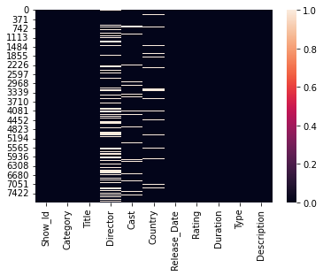
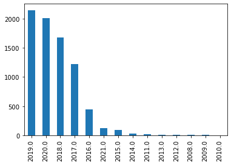
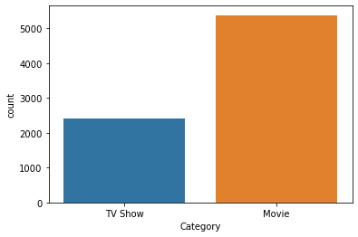

This **Netflix Dataset** has information about the TV Shows and Movies available on Netflix till 2021.

This dataset is collected from **Kaggle** website for **free**.


```python
#Import pandas
import pandas as pd
```


```python
data = pd.read_csv(r"E:\DATA SETS\Netflix Dataset.csv")
print('Dataset imported')
```

    Dataset imported
    


```python
data
```


<div>
<style scoped>
    .dataframe tbody tr th:only-of-type {
        vertical-align: middle;
    }

    .dataframe tbody tr th {
        vertical-align: top;
    }

    .dataframe thead th {
        text-align: right;
    }
</style>
<table border="1" class="dataframe">
  <thead>
    <tr style="text-align: right;">
      <th></th>
      <th>Show_Id</th>
      <th>Category</th>
      <th>Title</th>
      <th>Director</th>
      <th>Cast</th>
      <th>Country</th>
      <th>Release_Date</th>
      <th>Rating</th>
      <th>Duration</th>
      <th>Type</th>
      <th>Description</th>
    </tr>
  </thead>
  <tbody>
    <tr>
      <th>0</th>
      <td>s1</td>
      <td>TV Show</td>
      <td>3%</td>
      <td>NaN</td>
      <td>João Miguel, Bianca Comparato, Michel Gomes, R...</td>
      <td>Brazil</td>
      <td>August 14, 2020</td>
      <td>TV-MA</td>
      <td>4 Seasons</td>
      <td>International TV Shows, TV Dramas, TV Sci-Fi &amp;...</td>
      <td>In a future where the elite inhabit an island ...</td>
    </tr>
    <tr>
      <th>1</th>
      <td>s2</td>
      <td>Movie</td>
      <td>07:19</td>
      <td>Jorge Michel Grau</td>
      <td>Demián Bichir, Héctor Bonilla, Oscar Serrano, ...</td>
      <td>Mexico</td>
      <td>December 23, 2016</td>
      <td>TV-MA</td>
      <td>93 min</td>
      <td>Dramas, International Movies</td>
      <td>After a devastating earthquake hits Mexico Cit...</td>
    </tr>
    <tr>
      <th>2</th>
      <td>s3</td>
      <td>Movie</td>
      <td>23:59</td>
      <td>Gilbert Chan</td>
      <td>Tedd Chan, Stella Chung, Henley Hii, Lawrence ...</td>
      <td>Singapore</td>
      <td>December 20, 2018</td>
      <td>R</td>
      <td>78 min</td>
      <td>Horror Movies, International Movies</td>
      <td>When an army recruit is found dead, his fellow...</td>
    </tr>
    <tr>
      <th>3</th>
      <td>s4</td>
      <td>Movie</td>
      <td>9</td>
      <td>Shane Acker</td>
      <td>Elijah Wood, John C. Reilly, Jennifer Connelly...</td>
      <td>United States</td>
      <td>November 16, 2017</td>
      <td>PG-13</td>
      <td>80 min</td>
      <td>Action &amp; Adventure, Independent Movies, Sci-Fi...</td>
      <td>In a postapocalyptic world, rag-doll robots hi...</td>
    </tr>
    <tr>
      <th>4</th>
      <td>s5</td>
      <td>Movie</td>
      <td>21</td>
      <td>Robert Luketic</td>
      <td>Jim Sturgess, Kevin Spacey, Kate Bosworth, Aar...</td>
      <td>United States</td>
      <td>January 1, 2020</td>
      <td>PG-13</td>
      <td>123 min</td>
      <td>Dramas</td>
      <td>A brilliant group of students become card-coun...</td>
    </tr>
    <tr>
      <th>...</th>
      <td>...</td>
      <td>...</td>
      <td>...</td>
      <td>...</td>
      <td>...</td>
      <td>...</td>
      <td>...</td>
      <td>...</td>
      <td>...</td>
      <td>...</td>
      <td>...</td>
    </tr>
    <tr>
      <th>7784</th>
      <td>s7783</td>
      <td>Movie</td>
      <td>Zozo</td>
      <td>Josef Fares</td>
      <td>Imad Creidi, Antoinette Turk, Elias Gergi, Car...</td>
      <td>Sweden, Czech Republic, United Kingdom, Denmar...</td>
      <td>October 19, 2020</td>
      <td>TV-MA</td>
      <td>99 min</td>
      <td>Dramas, International Movies</td>
      <td>When Lebanon's Civil War deprives Zozo of his ...</td>
    </tr>
    <tr>
      <th>7785</th>
      <td>s7784</td>
      <td>Movie</td>
      <td>Zubaan</td>
      <td>Mozez Singh</td>
      <td>Vicky Kaushal, Sarah-Jane Dias, Raaghav Chanan...</td>
      <td>India</td>
      <td>March 2, 2019</td>
      <td>TV-14</td>
      <td>111 min</td>
      <td>Dramas, International Movies, Music &amp; Musicals</td>
      <td>A scrappy but poor boy worms his way into a ty...</td>
    </tr>
    <tr>
      <th>7786</th>
      <td>s7785</td>
      <td>Movie</td>
      <td>Zulu Man in Japan</td>
      <td>NaN</td>
      <td>Nasty C</td>
      <td>NaN</td>
      <td>September 25, 2020</td>
      <td>TV-MA</td>
      <td>44 min</td>
      <td>Documentaries, International Movies, Music &amp; M...</td>
      <td>In this documentary, South African rapper Nast...</td>
    </tr>
    <tr>
      <th>7787</th>
      <td>s7786</td>
      <td>TV Show</td>
      <td>Zumbo's Just Desserts</td>
      <td>NaN</td>
      <td>Adriano Zumbo, Rachel Khoo</td>
      <td>Australia</td>
      <td>October 31, 2020</td>
      <td>TV-PG</td>
      <td>1 Season</td>
      <td>International TV Shows, Reality TV</td>
      <td>Dessert wizard Adriano Zumbo looks for the nex...</td>
    </tr>
    <tr>
      <th>7788</th>
      <td>s7787</td>
      <td>Movie</td>
      <td>ZZ TOP: THAT LITTLE OL' BAND FROM TEXAS</td>
      <td>Sam Dunn</td>
      <td>NaN</td>
      <td>United Kingdom, Canada, United States</td>
      <td>March 1, 2020</td>
      <td>TV-MA</td>
      <td>90 min</td>
      <td>Documentaries, Music &amp; Musicals</td>
      <td>This documentary delves into the mystique behi...</td>
    </tr>
  </tbody>
</table>
<p>7789 rows × 11 columns</p>
</div>


### Getting some basic information about the dataset

**head()** to show top-5 records of dataset


```python
data.head()
```


<div>
<style scoped>
    .dataframe tbody tr th:only-of-type {
        vertical-align: middle;
    }

    .dataframe tbody tr th {
        vertical-align: top;
    }

    .dataframe thead th {
        text-align: right;
    }
</style>
<table border="1" class="dataframe">
  <thead>
    <tr style="text-align: right;">
      <th></th>
      <th>Show_Id</th>
      <th>Category</th>
      <th>Title</th>
      <th>Director</th>
      <th>Cast</th>
      <th>Country</th>
      <th>Release_Date</th>
      <th>Rating</th>
      <th>Duration</th>
      <th>Type</th>
      <th>Description</th>
    </tr>
  </thead>
  <tbody>
    <tr>
      <th>0</th>
      <td>s1</td>
      <td>TV Show</td>
      <td>3%</td>
      <td>NaN</td>
      <td>João Miguel, Bianca Comparato, Michel Gomes, R...</td>
      <td>Brazil</td>
      <td>August 14, 2020</td>
      <td>TV-MA</td>
      <td>4 Seasons</td>
      <td>International TV Shows, TV Dramas, TV Sci-Fi &amp;...</td>
      <td>In a future where the elite inhabit an island ...</td>
    </tr>
    <tr>
      <th>1</th>
      <td>s2</td>
      <td>Movie</td>
      <td>07:19</td>
      <td>Jorge Michel Grau</td>
      <td>Demián Bichir, Héctor Bonilla, Oscar Serrano, ...</td>
      <td>Mexico</td>
      <td>December 23, 2016</td>
      <td>TV-MA</td>
      <td>93 min</td>
      <td>Dramas, International Movies</td>
      <td>After a devastating earthquake hits Mexico Cit...</td>
    </tr>
    <tr>
      <th>2</th>
      <td>s3</td>
      <td>Movie</td>
      <td>23:59</td>
      <td>Gilbert Chan</td>
      <td>Tedd Chan, Stella Chung, Henley Hii, Lawrence ...</td>
      <td>Singapore</td>
      <td>December 20, 2018</td>
      <td>R</td>
      <td>78 min</td>
      <td>Horror Movies, International Movies</td>
      <td>When an army recruit is found dead, his fellow...</td>
    </tr>
    <tr>
      <th>3</th>
      <td>s4</td>
      <td>Movie</td>
      <td>9</td>
      <td>Shane Acker</td>
      <td>Elijah Wood, John C. Reilly, Jennifer Connelly...</td>
      <td>United States</td>
      <td>November 16, 2017</td>
      <td>PG-13</td>
      <td>80 min</td>
      <td>Action &amp; Adventure, Independent Movies, Sci-Fi...</td>
      <td>In a postapocalyptic world, rag-doll robots hi...</td>
    </tr>
    <tr>
      <th>4</th>
      <td>s5</td>
      <td>Movie</td>
      <td>21</td>
      <td>Robert Luketic</td>
      <td>Jim Sturgess, Kevin Spacey, Kate Bosworth, Aar...</td>
      <td>United States</td>
      <td>January 1, 2020</td>
      <td>PG-13</td>
      <td>123 min</td>
      <td>Dramas</td>
      <td>A brilliant group of students become card-coun...</td>
    </tr>
  </tbody>
</table>
</div>


**tail()** to show bottom-5 records of dataset


```python
data.tail()
```


<div>
<style scoped>
    .dataframe tbody tr th:only-of-type {
        vertical-align: middle;
    }

    .dataframe tbody tr th {
        vertical-align: top;
    }

    .dataframe thead th {
        text-align: right;
    }
</style>
<table border="1" class="dataframe">
  <thead>
    <tr style="text-align: right;">
      <th></th>
      <th>Show_Id</th>
      <th>Category</th>
      <th>Title</th>
      <th>Director</th>
      <th>Cast</th>
      <th>Country</th>
      <th>Release_Date</th>
      <th>Rating</th>
      <th>Duration</th>
      <th>Type</th>
      <th>Description</th>
    </tr>
  </thead>
  <tbody>
    <tr>
      <th>7784</th>
      <td>s7783</td>
      <td>Movie</td>
      <td>Zozo</td>
      <td>Josef Fares</td>
      <td>Imad Creidi, Antoinette Turk, Elias Gergi, Car...</td>
      <td>Sweden, Czech Republic, United Kingdom, Denmar...</td>
      <td>October 19, 2020</td>
      <td>TV-MA</td>
      <td>99 min</td>
      <td>Dramas, International Movies</td>
      <td>When Lebanon's Civil War deprives Zozo of his ...</td>
    </tr>
    <tr>
      <th>7785</th>
      <td>s7784</td>
      <td>Movie</td>
      <td>Zubaan</td>
      <td>Mozez Singh</td>
      <td>Vicky Kaushal, Sarah-Jane Dias, Raaghav Chanan...</td>
      <td>India</td>
      <td>March 2, 2019</td>
      <td>TV-14</td>
      <td>111 min</td>
      <td>Dramas, International Movies, Music &amp; Musicals</td>
      <td>A scrappy but poor boy worms his way into a ty...</td>
    </tr>
    <tr>
      <th>7786</th>
      <td>s7785</td>
      <td>Movie</td>
      <td>Zulu Man in Japan</td>
      <td>NaN</td>
      <td>Nasty C</td>
      <td>NaN</td>
      <td>September 25, 2020</td>
      <td>TV-MA</td>
      <td>44 min</td>
      <td>Documentaries, International Movies, Music &amp; M...</td>
      <td>In this documentary, South African rapper Nast...</td>
    </tr>
    <tr>
      <th>7787</th>
      <td>s7786</td>
      <td>TV Show</td>
      <td>Zumbo's Just Desserts</td>
      <td>NaN</td>
      <td>Adriano Zumbo, Rachel Khoo</td>
      <td>Australia</td>
      <td>October 31, 2020</td>
      <td>TV-PG</td>
      <td>1 Season</td>
      <td>International TV Shows, Reality TV</td>
      <td>Dessert wizard Adriano Zumbo looks for the nex...</td>
    </tr>
    <tr>
      <th>7788</th>
      <td>s7787</td>
      <td>Movie</td>
      <td>ZZ TOP: THAT LITTLE OL' BAND FROM TEXAS</td>
      <td>Sam Dunn</td>
      <td>NaN</td>
      <td>United Kingdom, Canada, United States</td>
      <td>March 1, 2020</td>
      <td>TV-MA</td>
      <td>90 min</td>
      <td>Documentaries, Music &amp; Musicals</td>
      <td>This documentary delves into the mystique behi...</td>
    </tr>
  </tbody>
</table>
</div>


**shape** to show the No. of Rows and Columns


```python
data.shape
```


    (7789, 11)


**size** to show No. of total values(elements) in the dataset


```python
data.size
```


    85679


**columns** to show each Column Name


```python
data.columns
```


    Index(['Show_Id', 'Category', 'Title', 'Director', 'Cast', 'Country',
           'Release_Date', 'Rating', 'Duration', 'Type', 'Description'],
          dtype='object')


**dtypes** to show the data-type of each column


```python
data.dtypes
```


    Show_Id         object
    Category        object
    Title           object
    Director        object
    Cast            object
    Country         object
    Release_Date    object
    Rating          object
    Duration        object
    Type            object
    Description     object
    dtype: object


**info()** to show indexes, columns, data-types opf each column, memory at once


```python
data.info()
```

    <class 'pandas.core.frame.DataFrame'>
    RangeIndex: 7789 entries, 0 to 7788
    Data columns (total 11 columns):
     #   Column        Non-Null Count  Dtype 
    ---  ------        --------------  ----- 
     0   Show_Id       7789 non-null   object
     1   Category      7789 non-null   object
     2   Title         7789 non-null   object
     3   Director      5401 non-null   object
     4   Cast          7071 non-null   object
     5   Country       7282 non-null   object
     6   Release_Date  7779 non-null   object
     7   Rating        7782 non-null   object
     8   Duration      7789 non-null   object
     9   Type          7789 non-null   object
     10  Description   7789 non-null   object
    dtypes: object(11)
    memory usage: 669.5+ KB
    

### Is there any Duplicate Record in this dataset? If yes, then remove the duplicate records.

**duplicate()** to detect duplicates values/records


```python
data.head()
```


<div>
<style scoped>
    .dataframe tbody tr th:only-of-type {
        vertical-align: middle;
    }

    .dataframe tbody tr th {
        vertical-align: top;
    }

    .dataframe thead th {
        text-align: right;
    }
</style>
<table border="1" class="dataframe">
  <thead>
    <tr style="text-align: right;">
      <th></th>
      <th>Show_Id</th>
      <th>Category</th>
      <th>Title</th>
      <th>Director</th>
      <th>Cast</th>
      <th>Country</th>
      <th>Release_Date</th>
      <th>Rating</th>
      <th>Duration</th>
      <th>Type</th>
      <th>Description</th>
    </tr>
  </thead>
  <tbody>
    <tr>
      <th>0</th>
      <td>s1</td>
      <td>TV Show</td>
      <td>3%</td>
      <td>NaN</td>
      <td>João Miguel, Bianca Comparato, Michel Gomes, R...</td>
      <td>Brazil</td>
      <td>August 14, 2020</td>
      <td>TV-MA</td>
      <td>4 Seasons</td>
      <td>International TV Shows, TV Dramas, TV Sci-Fi &amp;...</td>
      <td>In a future where the elite inhabit an island ...</td>
    </tr>
    <tr>
      <th>1</th>
      <td>s2</td>
      <td>Movie</td>
      <td>07:19</td>
      <td>Jorge Michel Grau</td>
      <td>Demián Bichir, Héctor Bonilla, Oscar Serrano, ...</td>
      <td>Mexico</td>
      <td>December 23, 2016</td>
      <td>TV-MA</td>
      <td>93 min</td>
      <td>Dramas, International Movies</td>
      <td>After a devastating earthquake hits Mexico Cit...</td>
    </tr>
    <tr>
      <th>2</th>
      <td>s3</td>
      <td>Movie</td>
      <td>23:59</td>
      <td>Gilbert Chan</td>
      <td>Tedd Chan, Stella Chung, Henley Hii, Lawrence ...</td>
      <td>Singapore</td>
      <td>December 20, 2018</td>
      <td>R</td>
      <td>78 min</td>
      <td>Horror Movies, International Movies</td>
      <td>When an army recruit is found dead, his fellow...</td>
    </tr>
    <tr>
      <th>3</th>
      <td>s4</td>
      <td>Movie</td>
      <td>9</td>
      <td>Shane Acker</td>
      <td>Elijah Wood, John C. Reilly, Jennifer Connelly...</td>
      <td>United States</td>
      <td>November 16, 2017</td>
      <td>PG-13</td>
      <td>80 min</td>
      <td>Action &amp; Adventure, Independent Movies, Sci-Fi...</td>
      <td>In a postapocalyptic world, rag-doll robots hi...</td>
    </tr>
    <tr>
      <th>4</th>
      <td>s5</td>
      <td>Movie</td>
      <td>21</td>
      <td>Robert Luketic</td>
      <td>Jim Sturgess, Kevin Spacey, Kate Bosworth, Aar...</td>
      <td>United States</td>
      <td>January 1, 2020</td>
      <td>PG-13</td>
      <td>123 min</td>
      <td>Dramas</td>
      <td>A brilliant group of students become card-coun...</td>
    </tr>
  </tbody>
</table>
</div>


```python
data.shape
```


    (7789, 11)


```python
#check duplicated records
data.duplicated()
```


    0       False
    1       False
    2       False
    3       False
    4       False
            ...  
    7784    False
    7785    False
    7786    False
    7787    False
    7788    False
    Length: 7789, dtype: bool


```python
data[data.duplicated()] #2 records duplicated
```


<div>
<style scoped>
    .dataframe tbody tr th:only-of-type {
        vertical-align: middle;
    }

    .dataframe tbody tr th {
        vertical-align: top;
    }

    .dataframe thead th {
        text-align: right;
    }
</style>
<table border="1" class="dataframe">
  <thead>
    <tr style="text-align: right;">
      <th></th>
      <th>Show_Id</th>
      <th>Category</th>
      <th>Title</th>
      <th>Director</th>
      <th>Cast</th>
      <th>Country</th>
      <th>Release_Date</th>
      <th>Rating</th>
      <th>Duration</th>
      <th>Type</th>
      <th>Description</th>
    </tr>
  </thead>
  <tbody>
    <tr>
      <th>6300</th>
      <td>s684</td>
      <td>Movie</td>
      <td>Backfire</td>
      <td>Dave Patten</td>
      <td>Black Deniro, Byron "Squally" Vinson, Dominic ...</td>
      <td>United States</td>
      <td>April 5, 2019</td>
      <td>TV-MA</td>
      <td>97 min</td>
      <td>Dramas, Independent Movies, Thrillers</td>
      <td>When two would-be robbers accidentally kill a ...</td>
    </tr>
    <tr>
      <th>6622</th>
      <td>s6621</td>
      <td>Movie</td>
      <td>The Lost Okoroshi</td>
      <td>Abba T. Makama</td>
      <td>Seun Ajayi, Judith Audu, Tope Tedela, Ifu Enna...</td>
      <td>Nigeria</td>
      <td>September 4, 2020</td>
      <td>TV-MA</td>
      <td>94 min</td>
      <td>Comedies, Dramas, Independent Movies</td>
      <td>A disillusioned security guard transforms into...</td>
    </tr>
  </tbody>
</table>
</div>


```python
#remove the duplicate rows permanently
data.drop_duplicates(inplace = True)
print('Duplicated values permanently removed')
```

    Duplicated values permanently removed
    


```python
#verify the operation 
data[data.duplicated()] #0 records duplicated
```


<div>
<style scoped>
    .dataframe tbody tr th:only-of-type {
        vertical-align: middle;
    }

    .dataframe tbody tr th {
        vertical-align: top;
    }

    .dataframe thead th {
        text-align: right;
    }
</style>
<table border="1" class="dataframe">
  <thead>
    <tr style="text-align: right;">
      <th></th>
      <th>Show_Id</th>
      <th>Category</th>
      <th>Title</th>
      <th>Director</th>
      <th>Cast</th>
      <th>Country</th>
      <th>Release_Date</th>
      <th>Rating</th>
      <th>Duration</th>
      <th>Type</th>
      <th>Description</th>
    </tr>
  </thead>
  <tbody>
  </tbody>
</table>
</div>


```python
data.shape ## first = 7789 / then second = 7787
```


    (7787, 11)


### Is there any Null Value in any column? Show with Heat-map

**isnull()** to show where Null value is present


```python
data.head()
```


<div>
<style scoped>
    .dataframe tbody tr th:only-of-type {
        vertical-align: middle;
    }

    .dataframe tbody tr th {
        vertical-align: top;
    }

    .dataframe thead th {
        text-align: right;
    }
</style>
<table border="1" class="dataframe">
  <thead>
    <tr style="text-align: right;">
      <th></th>
      <th>Show_Id</th>
      <th>Category</th>
      <th>Title</th>
      <th>Director</th>
      <th>Cast</th>
      <th>Country</th>
      <th>Release_Date</th>
      <th>Rating</th>
      <th>Duration</th>
      <th>Type</th>
      <th>Description</th>
    </tr>
  </thead>
  <tbody>
    <tr>
      <th>0</th>
      <td>s1</td>
      <td>TV Show</td>
      <td>3%</td>
      <td>NaN</td>
      <td>João Miguel, Bianca Comparato, Michel Gomes, R...</td>
      <td>Brazil</td>
      <td>August 14, 2020</td>
      <td>TV-MA</td>
      <td>4 Seasons</td>
      <td>International TV Shows, TV Dramas, TV Sci-Fi &amp;...</td>
      <td>In a future where the elite inhabit an island ...</td>
    </tr>
    <tr>
      <th>1</th>
      <td>s2</td>
      <td>Movie</td>
      <td>07:19</td>
      <td>Jorge Michel Grau</td>
      <td>Demián Bichir, Héctor Bonilla, Oscar Serrano, ...</td>
      <td>Mexico</td>
      <td>December 23, 2016</td>
      <td>TV-MA</td>
      <td>93 min</td>
      <td>Dramas, International Movies</td>
      <td>After a devastating earthquake hits Mexico Cit...</td>
    </tr>
    <tr>
      <th>2</th>
      <td>s3</td>
      <td>Movie</td>
      <td>23:59</td>
      <td>Gilbert Chan</td>
      <td>Tedd Chan, Stella Chung, Henley Hii, Lawrence ...</td>
      <td>Singapore</td>
      <td>December 20, 2018</td>
      <td>R</td>
      <td>78 min</td>
      <td>Horror Movies, International Movies</td>
      <td>When an army recruit is found dead, his fellow...</td>
    </tr>
    <tr>
      <th>3</th>
      <td>s4</td>
      <td>Movie</td>
      <td>9</td>
      <td>Shane Acker</td>
      <td>Elijah Wood, John C. Reilly, Jennifer Connelly...</td>
      <td>United States</td>
      <td>November 16, 2017</td>
      <td>PG-13</td>
      <td>80 min</td>
      <td>Action &amp; Adventure, Independent Movies, Sci-Fi...</td>
      <td>In a postapocalyptic world, rag-doll robots hi...</td>
    </tr>
    <tr>
      <th>4</th>
      <td>s5</td>
      <td>Movie</td>
      <td>21</td>
      <td>Robert Luketic</td>
      <td>Jim Sturgess, Kevin Spacey, Kate Bosworth, Aar...</td>
      <td>United States</td>
      <td>January 1, 2020</td>
      <td>PG-13</td>
      <td>123 min</td>
      <td>Dramas</td>
      <td>A brilliant group of students become card-coun...</td>
    </tr>
  </tbody>
</table>
</div>


```python
data.isnull() #to show where Null value is present
```


<div>
<style scoped>
    .dataframe tbody tr th:only-of-type {
        vertical-align: middle;
    }

    .dataframe tbody tr th {
        vertical-align: top;
    }

    .dataframe thead th {
        text-align: right;
    }
</style>
<table border="1" class="dataframe">
  <thead>
    <tr style="text-align: right;">
      <th></th>
      <th>Show_Id</th>
      <th>Category</th>
      <th>Title</th>
      <th>Director</th>
      <th>Cast</th>
      <th>Country</th>
      <th>Release_Date</th>
      <th>Rating</th>
      <th>Duration</th>
      <th>Type</th>
      <th>Description</th>
    </tr>
  </thead>
  <tbody>
    <tr>
      <th>0</th>
      <td>False</td>
      <td>False</td>
      <td>False</td>
      <td>True</td>
      <td>False</td>
      <td>False</td>
      <td>False</td>
      <td>False</td>
      <td>False</td>
      <td>False</td>
      <td>False</td>
    </tr>
    <tr>
      <th>1</th>
      <td>False</td>
      <td>False</td>
      <td>False</td>
      <td>False</td>
      <td>False</td>
      <td>False</td>
      <td>False</td>
      <td>False</td>
      <td>False</td>
      <td>False</td>
      <td>False</td>
    </tr>
    <tr>
      <th>2</th>
      <td>False</td>
      <td>False</td>
      <td>False</td>
      <td>False</td>
      <td>False</td>
      <td>False</td>
      <td>False</td>
      <td>False</td>
      <td>False</td>
      <td>False</td>
      <td>False</td>
    </tr>
    <tr>
      <th>3</th>
      <td>False</td>
      <td>False</td>
      <td>False</td>
      <td>False</td>
      <td>False</td>
      <td>False</td>
      <td>False</td>
      <td>False</td>
      <td>False</td>
      <td>False</td>
      <td>False</td>
    </tr>
    <tr>
      <th>4</th>
      <td>False</td>
      <td>False</td>
      <td>False</td>
      <td>False</td>
      <td>False</td>
      <td>False</td>
      <td>False</td>
      <td>False</td>
      <td>False</td>
      <td>False</td>
      <td>False</td>
    </tr>
    <tr>
      <th>...</th>
      <td>...</td>
      <td>...</td>
      <td>...</td>
      <td>...</td>
      <td>...</td>
      <td>...</td>
      <td>...</td>
      <td>...</td>
      <td>...</td>
      <td>...</td>
      <td>...</td>
    </tr>
    <tr>
      <th>7784</th>
      <td>False</td>
      <td>False</td>
      <td>False</td>
      <td>False</td>
      <td>False</td>
      <td>False</td>
      <td>False</td>
      <td>False</td>
      <td>False</td>
      <td>False</td>
      <td>False</td>
    </tr>
    <tr>
      <th>7785</th>
      <td>False</td>
      <td>False</td>
      <td>False</td>
      <td>False</td>
      <td>False</td>
      <td>False</td>
      <td>False</td>
      <td>False</td>
      <td>False</td>
      <td>False</td>
      <td>False</td>
    </tr>
    <tr>
      <th>7786</th>
      <td>False</td>
      <td>False</td>
      <td>False</td>
      <td>True</td>
      <td>False</td>
      <td>True</td>
      <td>False</td>
      <td>False</td>
      <td>False</td>
      <td>False</td>
      <td>False</td>
    </tr>
    <tr>
      <th>7787</th>
      <td>False</td>
      <td>False</td>
      <td>False</td>
      <td>True</td>
      <td>False</td>
      <td>False</td>
      <td>False</td>
      <td>False</td>
      <td>False</td>
      <td>False</td>
      <td>False</td>
    </tr>
    <tr>
      <th>7788</th>
      <td>False</td>
      <td>False</td>
      <td>False</td>
      <td>False</td>
      <td>True</td>
      <td>False</td>
      <td>False</td>
      <td>False</td>
      <td>False</td>
      <td>False</td>
      <td>False</td>
    </tr>
  </tbody>
</table>
<p>7787 rows × 11 columns</p>
</div>


```python
data.isnull().sum() #to show the count of Null Values in each column
```


    Show_Id            0
    Category           0
    Title              0
    Director        2388
    Cast             718
    Country          507
    Release_Date      10
    Rating             7
    Duration           0
    Type               0
    Description        0
    dtype: int64


**seaborn library (Heat-map)**


```python
#import seaborn library
import seaborn as sns 
```


```python
#Using heatmap to show null values count
sns.heatmap(data.isnull())
```


    <AxesSubplot:>


    

    


### For 'House of Cards', what is the Show Id and Who is the Director of this show?

**isin()** as option 1: to show all records of a particular item in any column


```python
data.head()
```


<div>
<style scoped>
    .dataframe tbody tr th:only-of-type {
        vertical-align: middle;
    }

    .dataframe tbody tr th {
        vertical-align: top;
    }

    .dataframe thead th {
        text-align: right;
    }
</style>
<table border="1" class="dataframe">
  <thead>
    <tr style="text-align: right;">
      <th></th>
      <th>Show_Id</th>
      <th>Category</th>
      <th>Title</th>
      <th>Director</th>
      <th>Cast</th>
      <th>Country</th>
      <th>Release_Date</th>
      <th>Rating</th>
      <th>Duration</th>
      <th>Type</th>
      <th>Description</th>
    </tr>
  </thead>
  <tbody>
    <tr>
      <th>0</th>
      <td>s1</td>
      <td>TV Show</td>
      <td>3%</td>
      <td>NaN</td>
      <td>João Miguel, Bianca Comparato, Michel Gomes, R...</td>
      <td>Brazil</td>
      <td>August 14, 2020</td>
      <td>TV-MA</td>
      <td>4 Seasons</td>
      <td>International TV Shows, TV Dramas, TV Sci-Fi &amp;...</td>
      <td>In a future where the elite inhabit an island ...</td>
    </tr>
    <tr>
      <th>1</th>
      <td>s2</td>
      <td>Movie</td>
      <td>07:19</td>
      <td>Jorge Michel Grau</td>
      <td>Demián Bichir, Héctor Bonilla, Oscar Serrano, ...</td>
      <td>Mexico</td>
      <td>December 23, 2016</td>
      <td>TV-MA</td>
      <td>93 min</td>
      <td>Dramas, International Movies</td>
      <td>After a devastating earthquake hits Mexico Cit...</td>
    </tr>
    <tr>
      <th>2</th>
      <td>s3</td>
      <td>Movie</td>
      <td>23:59</td>
      <td>Gilbert Chan</td>
      <td>Tedd Chan, Stella Chung, Henley Hii, Lawrence ...</td>
      <td>Singapore</td>
      <td>December 20, 2018</td>
      <td>R</td>
      <td>78 min</td>
      <td>Horror Movies, International Movies</td>
      <td>When an army recruit is found dead, his fellow...</td>
    </tr>
    <tr>
      <th>3</th>
      <td>s4</td>
      <td>Movie</td>
      <td>9</td>
      <td>Shane Acker</td>
      <td>Elijah Wood, John C. Reilly, Jennifer Connelly...</td>
      <td>United States</td>
      <td>November 16, 2017</td>
      <td>PG-13</td>
      <td>80 min</td>
      <td>Action &amp; Adventure, Independent Movies, Sci-Fi...</td>
      <td>In a postapocalyptic world, rag-doll robots hi...</td>
    </tr>
    <tr>
      <th>4</th>
      <td>s5</td>
      <td>Movie</td>
      <td>21</td>
      <td>Robert Luketic</td>
      <td>Jim Sturgess, Kevin Spacey, Kate Bosworth, Aar...</td>
      <td>United States</td>
      <td>January 1, 2020</td>
      <td>PG-13</td>
      <td>123 min</td>
      <td>Dramas</td>
      <td>A brilliant group of students become card-coun...</td>
    </tr>
  </tbody>
</table>
</div>


```python
#to show all records of a particular item in any column
data[data['Title'].isin(['House of Cards'])]
# Show_Id = s2833
#Director = Robin Wright, David Fincher, Gerald McRaney, J...
```


<div>
<style scoped>
    .dataframe tbody tr th:only-of-type {
        vertical-align: middle;
    }

    .dataframe tbody tr th {
        vertical-align: top;
    }

    .dataframe thead th {
        text-align: right;
    }
</style>
<table border="1" class="dataframe">
  <thead>
    <tr style="text-align: right;">
      <th></th>
      <th>Show_Id</th>
      <th>Category</th>
      <th>Title</th>
      <th>Director</th>
      <th>Cast</th>
      <th>Country</th>
      <th>Release_Date</th>
      <th>Rating</th>
      <th>Duration</th>
      <th>Type</th>
      <th>Description</th>
    </tr>
  </thead>
  <tbody>
    <tr>
      <th>2832</th>
      <td>s2833</td>
      <td>TV Show</td>
      <td>House of Cards</td>
      <td>Robin Wright, David Fincher, Gerald McRaney, J...</td>
      <td>Kevin Spacey, Robin Wright, Kate Mara, Corey S...</td>
      <td>United States</td>
      <td>November 2, 2018</td>
      <td>TV-MA</td>
      <td>6 Seasons</td>
      <td>TV Dramas, TV Thrillers</td>
      <td>A ruthless politician will stop at nothing to ...</td>
    </tr>
  </tbody>
</table>
</div>


**str.contains()** as option 2: to show all records of a particular string in any column


```python
#to show all records of a particular string in any column
data[data['Title'].str.contains('House of Cards')]
```


<div>
<style scoped>
    .dataframe tbody tr th:only-of-type {
        vertical-align: middle;
    }

    .dataframe tbody tr th {
        vertical-align: top;
    }

    .dataframe thead th {
        text-align: right;
    }
</style>
<table border="1" class="dataframe">
  <thead>
    <tr style="text-align: right;">
      <th></th>
      <th>Show_Id</th>
      <th>Category</th>
      <th>Title</th>
      <th>Director</th>
      <th>Cast</th>
      <th>Country</th>
      <th>Release_Date</th>
      <th>Rating</th>
      <th>Duration</th>
      <th>Type</th>
      <th>Description</th>
    </tr>
  </thead>
  <tbody>
    <tr>
      <th>2832</th>
      <td>s2833</td>
      <td>TV Show</td>
      <td>House of Cards</td>
      <td>Robin Wright, David Fincher, Gerald McRaney, J...</td>
      <td>Kevin Spacey, Robin Wright, Kate Mara, Corey S...</td>
      <td>United States</td>
      <td>November 2, 2018</td>
      <td>TV-MA</td>
      <td>6 Seasons</td>
      <td>TV Dramas, TV Thrillers</td>
      <td>A ruthless politician will stop at nothing to ...</td>
    </tr>
  </tbody>
</table>
</div>


### In which year highest number of the TV Shows & Movies were released? Show the info with a Bar Graph.

**dtypes** all elements


```python
data.dtypes #Release_date need a date time format
```


    Show_Id         object
    Category        object
    Title           object
    Director        object
    Cast            object
    Country         object
    Release_Date    object
    Rating          object
    Duration        object
    Type            object
    Description     object
    dtype: object


**to_datetime** to datetime format


```python
data['Date_N'] = pd.to_datetime(data['Release_Date'])
print('format changed')
```

    format changed
    


```python
# Date_N column created
data.head()
```


<div>
<style scoped>
    .dataframe tbody tr th:only-of-type {
        vertical-align: middle;
    }

    .dataframe tbody tr th {
        vertical-align: top;
    }

    .dataframe thead th {
        text-align: right;
    }
</style>
<table border="1" class="dataframe">
  <thead>
    <tr style="text-align: right;">
      <th></th>
      <th>Show_Id</th>
      <th>Category</th>
      <th>Title</th>
      <th>Director</th>
      <th>Cast</th>
      <th>Country</th>
      <th>Release_Date</th>
      <th>Rating</th>
      <th>Duration</th>
      <th>Type</th>
      <th>Description</th>
      <th>Date_N</th>
    </tr>
  </thead>
  <tbody>
    <tr>
      <th>0</th>
      <td>s1</td>
      <td>TV Show</td>
      <td>3%</td>
      <td>NaN</td>
      <td>João Miguel, Bianca Comparato, Michel Gomes, R...</td>
      <td>Brazil</td>
      <td>August 14, 2020</td>
      <td>TV-MA</td>
      <td>4 Seasons</td>
      <td>International TV Shows, TV Dramas, TV Sci-Fi &amp;...</td>
      <td>In a future where the elite inhabit an island ...</td>
      <td>2020-08-14</td>
    </tr>
    <tr>
      <th>1</th>
      <td>s2</td>
      <td>Movie</td>
      <td>07:19</td>
      <td>Jorge Michel Grau</td>
      <td>Demián Bichir, Héctor Bonilla, Oscar Serrano, ...</td>
      <td>Mexico</td>
      <td>December 23, 2016</td>
      <td>TV-MA</td>
      <td>93 min</td>
      <td>Dramas, International Movies</td>
      <td>After a devastating earthquake hits Mexico Cit...</td>
      <td>2016-12-23</td>
    </tr>
    <tr>
      <th>2</th>
      <td>s3</td>
      <td>Movie</td>
      <td>23:59</td>
      <td>Gilbert Chan</td>
      <td>Tedd Chan, Stella Chung, Henley Hii, Lawrence ...</td>
      <td>Singapore</td>
      <td>December 20, 2018</td>
      <td>R</td>
      <td>78 min</td>
      <td>Horror Movies, International Movies</td>
      <td>When an army recruit is found dead, his fellow...</td>
      <td>2018-12-20</td>
    </tr>
    <tr>
      <th>3</th>
      <td>s4</td>
      <td>Movie</td>
      <td>9</td>
      <td>Shane Acker</td>
      <td>Elijah Wood, John C. Reilly, Jennifer Connelly...</td>
      <td>United States</td>
      <td>November 16, 2017</td>
      <td>PG-13</td>
      <td>80 min</td>
      <td>Action &amp; Adventure, Independent Movies, Sci-Fi...</td>
      <td>In a postapocalyptic world, rag-doll robots hi...</td>
      <td>2017-11-16</td>
    </tr>
    <tr>
      <th>4</th>
      <td>s5</td>
      <td>Movie</td>
      <td>21</td>
      <td>Robert Luketic</td>
      <td>Jim Sturgess, Kevin Spacey, Kate Bosworth, Aar...</td>
      <td>United States</td>
      <td>January 1, 2020</td>
      <td>PG-13</td>
      <td>123 min</td>
      <td>Dramas</td>
      <td>A brilliant group of students become card-coun...</td>
      <td>2020-01-01</td>
    </tr>
  </tbody>
</table>
</div>


```python
#check again dtypes of the dataset
data.dtypes # Date_N with datetime format
```


    Show_Id                 object
    Category                object
    Title                   object
    Director                object
    Cast                    object
    Country                 object
    Release_Date            object
    Rating                  object
    Duration                object
    Type                    object
    Description             object
    Date_N          datetime64[ns]
    dtype: object


**dt.year.value_counts()** It counts the ocurrence of all individual Years in Date column


```python
#It counts the ocurrence of all individual Years in Date column
data['Date_N'].dt.year.value_counts() # the answer is 2019 
```


    2019.0    2153
    2020.0    2009
    2018.0    1685
    2017.0    1225
    2016.0     443
    2021.0     117
    2015.0      88
    2014.0      25
    2011.0      13
    2013.0      11
    2012.0       3
    2008.0       2
    2009.0       2
    2010.0       1
    Name: Date_N, dtype: int64


**Bar Graph**


```python
data['Date_N'].dt.year.value_counts().plot(kind='bar')
```


    <AxesSubplot:>


    

    


### How many Movies & TV Shows are in the dataset? Show with a Bar graph

**groupby()** to group all unique items of a column and show their count


```python
data.head(2)
```


<div>
<style scoped>
    .dataframe tbody tr th:only-of-type {
        vertical-align: middle;
    }

    .dataframe tbody tr th {
        vertical-align: top;
    }

    .dataframe thead th {
        text-align: right;
    }
</style>
<table border="1" class="dataframe">
  <thead>
    <tr style="text-align: right;">
      <th></th>
      <th>Show_Id</th>
      <th>Category</th>
      <th>Title</th>
      <th>Director</th>
      <th>Cast</th>
      <th>Country</th>
      <th>Release_Date</th>
      <th>Rating</th>
      <th>Duration</th>
      <th>Type</th>
      <th>Description</th>
      <th>Date_N</th>
    </tr>
  </thead>
  <tbody>
    <tr>
      <th>0</th>
      <td>s1</td>
      <td>TV Show</td>
      <td>3%</td>
      <td>NaN</td>
      <td>João Miguel, Bianca Comparato, Michel Gomes, R...</td>
      <td>Brazil</td>
      <td>August 14, 2020</td>
      <td>TV-MA</td>
      <td>4 Seasons</td>
      <td>International TV Shows, TV Dramas, TV Sci-Fi &amp;...</td>
      <td>In a future where the elite inhabit an island ...</td>
      <td>2020-08-14</td>
    </tr>
    <tr>
      <th>1</th>
      <td>s2</td>
      <td>Movie</td>
      <td>07:19</td>
      <td>Jorge Michel Grau</td>
      <td>Demián Bichir, Héctor Bonilla, Oscar Serrano, ...</td>
      <td>Mexico</td>
      <td>December 23, 2016</td>
      <td>TV-MA</td>
      <td>93 min</td>
      <td>Dramas, International Movies</td>
      <td>After a devastating earthquake hits Mexico Cit...</td>
      <td>2016-12-23</td>
    </tr>
  </tbody>
</table>
</div>


```python
data.groupby('Category')
```


    <pandas.core.groupby.generic.DataFrameGroupBy object at 0x000001F898DCCC70>


```python
data.groupby('Category').Category.count() 
```


    Category
    Movie      5377
    TV Show    2410
    Name: Category, dtype: int64


**countplot()** to show the count of all unique values of any column in the form of bar graph


```python
sns.countplot(x='Category', data=data)
```


    <AxesSubplot:xlabel='Category', ylabel='count'>


    

    


### Show all the Movies that were released in year 2000.

**Creating new column** to create new Year column, it will consider only year


```python
#data.head()
data.head(2)
```


<div>
<style scoped>
    .dataframe tbody tr th:only-of-type {
        vertical-align: middle;
    }

    .dataframe tbody tr th {
        vertical-align: top;
    }

    .dataframe thead th {
        text-align: right;
    }
</style>
<table border="1" class="dataframe">
  <thead>
    <tr style="text-align: right;">
      <th></th>
      <th>Show_Id</th>
      <th>Category</th>
      <th>Title</th>
      <th>Director</th>
      <th>Cast</th>
      <th>Country</th>
      <th>Release_Date</th>
      <th>Rating</th>
      <th>Duration</th>
      <th>Type</th>
      <th>Description</th>
      <th>Date_N</th>
    </tr>
  </thead>
  <tbody>
    <tr>
      <th>0</th>
      <td>s1</td>
      <td>TV Show</td>
      <td>3%</td>
      <td>NaN</td>
      <td>João Miguel, Bianca Comparato, Michel Gomes, R...</td>
      <td>Brazil</td>
      <td>August 14, 2020</td>
      <td>TV-MA</td>
      <td>4 Seasons</td>
      <td>International TV Shows, TV Dramas, TV Sci-Fi &amp;...</td>
      <td>In a future where the elite inhabit an island ...</td>
      <td>2020-08-14</td>
    </tr>
    <tr>
      <th>1</th>
      <td>s2</td>
      <td>Movie</td>
      <td>07:19</td>
      <td>Jorge Michel Grau</td>
      <td>Demián Bichir, Héctor Bonilla, Oscar Serrano, ...</td>
      <td>Mexico</td>
      <td>December 23, 2016</td>
      <td>TV-MA</td>
      <td>93 min</td>
      <td>Dramas, International Movies</td>
      <td>After a devastating earthquake hits Mexico Cit...</td>
      <td>2016-12-23</td>
    </tr>
  </tbody>
</table>
</div>


```python
#data['Year'] = data['Date_N'].dt.year

data['Year'] = data['Date_N'].dt.year # Year Column created
```


```python
#data.head()
data.head(2)
```


<div>
<style scoped>
    .dataframe tbody tr th:only-of-type {
        vertical-align: middle;
    }

    .dataframe tbody tr th {
        vertical-align: top;
    }

    .dataframe thead th {
        text-align: right;
    }
</style>
<table border="1" class="dataframe">
  <thead>
    <tr style="text-align: right;">
      <th></th>
      <th>Show_Id</th>
      <th>Category</th>
      <th>Title</th>
      <th>Director</th>
      <th>Cast</th>
      <th>Country</th>
      <th>Release_Date</th>
      <th>Rating</th>
      <th>Duration</th>
      <th>Type</th>
      <th>Description</th>
      <th>Date_N</th>
      <th>Year</th>
    </tr>
  </thead>
  <tbody>
    <tr>
      <th>0</th>
      <td>s1</td>
      <td>TV Show</td>
      <td>3%</td>
      <td>NaN</td>
      <td>João Miguel, Bianca Comparato, Michel Gomes, R...</td>
      <td>Brazil</td>
      <td>August 14, 2020</td>
      <td>TV-MA</td>
      <td>4 Seasons</td>
      <td>International TV Shows, TV Dramas, TV Sci-Fi &amp;...</td>
      <td>In a future where the elite inhabit an island ...</td>
      <td>2020-08-14</td>
      <td>2020.0</td>
    </tr>
    <tr>
      <th>1</th>
      <td>s2</td>
      <td>Movie</td>
      <td>07:19</td>
      <td>Jorge Michel Grau</td>
      <td>Demián Bichir, Héctor Bonilla, Oscar Serrano, ...</td>
      <td>Mexico</td>
      <td>December 23, 2016</td>
      <td>TV-MA</td>
      <td>93 min</td>
      <td>Dramas, International Movies</td>
      <td>After a devastating earthquake hits Mexico Cit...</td>
      <td>2016-12-23</td>
      <td>2016.0</td>
    </tr>
  </tbody>
</table>
</div>


**Filtering**


```python
#data[(data['Category']=='Movie') & (data['Year']==2020)]

data[(data['Category'] == 'Movie') & (data['Year']==2020)]
```


<div>
<style scoped>
    .dataframe tbody tr th:only-of-type {
        vertical-align: middle;
    }

    .dataframe tbody tr th {
        vertical-align: top;
    }

    .dataframe thead th {
        text-align: right;
    }
</style>
<table border="1" class="dataframe">
  <thead>
    <tr style="text-align: right;">
      <th></th>
      <th>Show_Id</th>
      <th>Category</th>
      <th>Title</th>
      <th>Director</th>
      <th>Cast</th>
      <th>Country</th>
      <th>Release_Date</th>
      <th>Rating</th>
      <th>Duration</th>
      <th>Type</th>
      <th>Description</th>
      <th>Date_N</th>
      <th>Year</th>
    </tr>
  </thead>
  <tbody>
    <tr>
      <th>4</th>
      <td>s5</td>
      <td>Movie</td>
      <td>21</td>
      <td>Robert Luketic</td>
      <td>Jim Sturgess, Kevin Spacey, Kate Bosworth, Aar...</td>
      <td>United States</td>
      <td>January 1, 2020</td>
      <td>PG-13</td>
      <td>123 min</td>
      <td>Dramas</td>
      <td>A brilliant group of students become card-coun...</td>
      <td>2020-01-01</td>
      <td>2020.0</td>
    </tr>
    <tr>
      <th>6</th>
      <td>s7</td>
      <td>Movie</td>
      <td>122</td>
      <td>Yasir Al Yasiri</td>
      <td>Amina Khalil, Ahmed Dawood, Tarek Lotfy, Ahmed...</td>
      <td>Egypt</td>
      <td>June 1, 2020</td>
      <td>TV-MA</td>
      <td>95 min</td>
      <td>Horror Movies, International Movies</td>
      <td>After an awful accident, a couple admitted to ...</td>
      <td>2020-06-01</td>
      <td>2020.0</td>
    </tr>
    <tr>
      <th>14</th>
      <td>s15</td>
      <td>Movie</td>
      <td>3022</td>
      <td>John Suits</td>
      <td>Omar Epps, Kate Walsh, Miranda Cosgrove, Angus...</td>
      <td>United States</td>
      <td>March 19, 2020</td>
      <td>R</td>
      <td>91 min</td>
      <td>Independent Movies, Sci-Fi &amp; Fantasy, Thrillers</td>
      <td>Stranded when the Earth is suddenly destroyed ...</td>
      <td>2020-03-19</td>
      <td>2020.0</td>
    </tr>
    <tr>
      <th>27</th>
      <td>s28</td>
      <td>Movie</td>
      <td>#Alive</td>
      <td>Cho Il</td>
      <td>Yoo Ah-in, Park Shin-hye</td>
      <td>South Korea</td>
      <td>September 8, 2020</td>
      <td>TV-MA</td>
      <td>99 min</td>
      <td>Horror Movies, International Movies, Thrillers</td>
      <td>As a grisly virus rampages a city, a lone man ...</td>
      <td>2020-09-08</td>
      <td>2020.0</td>
    </tr>
    <tr>
      <th>28</th>
      <td>s29</td>
      <td>Movie</td>
      <td>#AnneFrank - Parallel Stories</td>
      <td>Sabina Fedeli, Anna Migotto</td>
      <td>Helen Mirren, Gengher Gatti</td>
      <td>Italy</td>
      <td>July 1, 2020</td>
      <td>TV-14</td>
      <td>95 min</td>
      <td>Documentaries, International Movies</td>
      <td>Through her diary, Anne Frank's story is retol...</td>
      <td>2020-07-01</td>
      <td>2020.0</td>
    </tr>
    <tr>
      <th>...</th>
      <td>...</td>
      <td>...</td>
      <td>...</td>
      <td>...</td>
      <td>...</td>
      <td>...</td>
      <td>...</td>
      <td>...</td>
      <td>...</td>
      <td>...</td>
      <td>...</td>
      <td>...</td>
      <td>...</td>
    </tr>
    <tr>
      <th>7762</th>
      <td>s7761</td>
      <td>Movie</td>
      <td>Zaki Chan</td>
      <td>Wael Ihsan</td>
      <td>Ahmed Helmy, Yasmin Abdulaziz, Hassan Hosny, H...</td>
      <td>Egypt</td>
      <td>May 19, 2020</td>
      <td>TV-PG</td>
      <td>109 min</td>
      <td>Comedies, International Movies, Romantic Movies</td>
      <td>An unqualified young man has his work cut out ...</td>
      <td>2020-05-19</td>
      <td>2020.0</td>
    </tr>
    <tr>
      <th>7783</th>
      <td>s7782</td>
      <td>Movie</td>
      <td>Zoom</td>
      <td>Peter Hewitt</td>
      <td>Tim Allen, Courteney Cox, Chevy Chase, Kate Ma...</td>
      <td>United States</td>
      <td>January 11, 2020</td>
      <td>PG</td>
      <td>88 min</td>
      <td>Children &amp; Family Movies, Comedies</td>
      <td>Dragged from civilian life, a former superhero...</td>
      <td>2020-01-11</td>
      <td>2020.0</td>
    </tr>
    <tr>
      <th>7784</th>
      <td>s7783</td>
      <td>Movie</td>
      <td>Zozo</td>
      <td>Josef Fares</td>
      <td>Imad Creidi, Antoinette Turk, Elias Gergi, Car...</td>
      <td>Sweden, Czech Republic, United Kingdom, Denmar...</td>
      <td>October 19, 2020</td>
      <td>TV-MA</td>
      <td>99 min</td>
      <td>Dramas, International Movies</td>
      <td>When Lebanon's Civil War deprives Zozo of his ...</td>
      <td>2020-10-19</td>
      <td>2020.0</td>
    </tr>
    <tr>
      <th>7786</th>
      <td>s7785</td>
      <td>Movie</td>
      <td>Zulu Man in Japan</td>
      <td>NaN</td>
      <td>Nasty C</td>
      <td>NaN</td>
      <td>September 25, 2020</td>
      <td>TV-MA</td>
      <td>44 min</td>
      <td>Documentaries, International Movies, Music &amp; M...</td>
      <td>In this documentary, South African rapper Nast...</td>
      <td>2020-09-25</td>
      <td>2020.0</td>
    </tr>
    <tr>
      <th>7788</th>
      <td>s7787</td>
      <td>Movie</td>
      <td>ZZ TOP: THAT LITTLE OL' BAND FROM TEXAS</td>
      <td>Sam Dunn</td>
      <td>NaN</td>
      <td>United Kingdom, Canada, United States</td>
      <td>March 1, 2020</td>
      <td>TV-MA</td>
      <td>90 min</td>
      <td>Documentaries, Music &amp; Musicals</td>
      <td>This documentary delves into the mystique behi...</td>
      <td>2020-03-01</td>
      <td>2020.0</td>
    </tr>
  </tbody>
</table>
<p>1312 rows × 13 columns</p>
</div>


```python
data[(data['Category'] == 'Movie') & (data['Year']==2000)] # 2000 no movie release
```


<div>
<style scoped>
    .dataframe tbody tr th:only-of-type {
        vertical-align: middle;
    }

    .dataframe tbody tr th {
        vertical-align: top;
    }

    .dataframe thead th {
        text-align: right;
    }
</style>
<table border="1" class="dataframe">
  <thead>
    <tr style="text-align: right;">
      <th></th>
      <th>Show_Id</th>
      <th>Category</th>
      <th>Title</th>
      <th>Director</th>
      <th>Cast</th>
      <th>Country</th>
      <th>Release_Date</th>
      <th>Rating</th>
      <th>Duration</th>
      <th>Type</th>
      <th>Description</th>
      <th>Date_N</th>
      <th>Year</th>
    </tr>
  </thead>
  <tbody>
  </tbody>
</table>
</div>


### Show only the Titles of all TV Shows that were released in India only.

**Filtering**


```python
#data.head(2)
data.head(2)
```


<div>
<style scoped>
    .dataframe tbody tr th:only-of-type {
        vertical-align: middle;
    }

    .dataframe tbody tr th {
        vertical-align: top;
    }

    .dataframe thead th {
        text-align: right;
    }
</style>
<table border="1" class="dataframe">
  <thead>
    <tr style="text-align: right;">
      <th></th>
      <th>Show_Id</th>
      <th>Category</th>
      <th>Title</th>
      <th>Director</th>
      <th>Cast</th>
      <th>Country</th>
      <th>Release_Date</th>
      <th>Rating</th>
      <th>Duration</th>
      <th>Type</th>
      <th>Description</th>
      <th>Date_N</th>
      <th>Year</th>
    </tr>
  </thead>
  <tbody>
    <tr>
      <th>0</th>
      <td>s1</td>
      <td>TV Show</td>
      <td>3%</td>
      <td>NaN</td>
      <td>João Miguel, Bianca Comparato, Michel Gomes, R...</td>
      <td>Brazil</td>
      <td>August 14, 2020</td>
      <td>TV-MA</td>
      <td>4 Seasons</td>
      <td>International TV Shows, TV Dramas, TV Sci-Fi &amp;...</td>
      <td>In a future where the elite inhabit an island ...</td>
      <td>2020-08-14</td>
      <td>2020.0</td>
    </tr>
    <tr>
      <th>1</th>
      <td>s2</td>
      <td>Movie</td>
      <td>07:19</td>
      <td>Jorge Michel Grau</td>
      <td>Demián Bichir, Héctor Bonilla, Oscar Serrano, ...</td>
      <td>Mexico</td>
      <td>December 23, 2016</td>
      <td>TV-MA</td>
      <td>93 min</td>
      <td>Dramas, International Movies</td>
      <td>After a devastating earthquake hits Mexico Cit...</td>
      <td>2016-12-23</td>
      <td>2016.0</td>
    </tr>
  </tbody>
</table>
</div>


```python
data[ (data['Category'] == 'TV Show') & (data['Country'] == 'India') ]
```


<div>
<style scoped>
    .dataframe tbody tr th:only-of-type {
        vertical-align: middle;
    }

    .dataframe tbody tr th {
        vertical-align: top;
    }

    .dataframe thead th {
        text-align: right;
    }
</style>
<table border="1" class="dataframe">
  <thead>
    <tr style="text-align: right;">
      <th></th>
      <th>Show_Id</th>
      <th>Category</th>
      <th>Title</th>
      <th>Director</th>
      <th>Cast</th>
      <th>Country</th>
      <th>Release_Date</th>
      <th>Rating</th>
      <th>Duration</th>
      <th>Type</th>
      <th>Description</th>
      <th>Date_N</th>
      <th>Year</th>
    </tr>
  </thead>
  <tbody>
    <tr>
      <th>86</th>
      <td>s87</td>
      <td>TV Show</td>
      <td>21 Sarfarosh: Saragarhi 1897</td>
      <td>NaN</td>
      <td>Luke Kenny, Mohit Raina, Mukul Dev</td>
      <td>India</td>
      <td>December 1, 2018</td>
      <td>TV-14</td>
      <td>1 Season</td>
      <td>International TV Shows, TV Dramas</td>
      <td>In one of history's greatest last stands, a ba...</td>
      <td>2018-12-01</td>
      <td>2018.0</td>
    </tr>
    <tr>
      <th>132</th>
      <td>s133</td>
      <td>TV Show</td>
      <td>7 (Seven)</td>
      <td>Nizar Shafi</td>
      <td>Rahman, Havish, Regina Cassandra, Nandita Swet...</td>
      <td>India</td>
      <td>July 30, 2019</td>
      <td>TV-14</td>
      <td>1 Season</td>
      <td>TV Shows</td>
      <td>Multiple women report their husbands as missin...</td>
      <td>2019-07-30</td>
      <td>2019.0</td>
    </tr>
    <tr>
      <th>340</th>
      <td>s341</td>
      <td>TV Show</td>
      <td>Agent Raghav</td>
      <td>NaN</td>
      <td>Sharad Kelkar, Aahana Kumra, Mahesh Manjrekar,...</td>
      <td>India</td>
      <td>April 15, 2017</td>
      <td>TV-14</td>
      <td>1 Season</td>
      <td>Crime TV Shows, International TV Shows, TV Act...</td>
      <td>A mix of brilliance, erudition and skill enabl...</td>
      <td>2017-04-15</td>
      <td>2017.0</td>
    </tr>
    <tr>
      <th>364</th>
      <td>s365</td>
      <td>TV Show</td>
      <td>Akbar Birbal</td>
      <td>NaN</td>
      <td>Kiku Sharda, Vishal Kotian, Delnaaz Irani</td>
      <td>India</td>
      <td>March 31, 2020</td>
      <td>TV-G</td>
      <td>1 Season</td>
      <td>Kids' TV, TV Comedies, TV Dramas</td>
      <td>From battles of wit to fights for justice, Emp...</td>
      <td>2020-03-31</td>
      <td>2020.0</td>
    </tr>
    <tr>
      <th>533</th>
      <td>s534</td>
      <td>TV Show</td>
      <td>Anjaan: Rural Myths</td>
      <td>NaN</td>
      <td>NaN</td>
      <td>India</td>
      <td>December 15, 2018</td>
      <td>TV-14</td>
      <td>1 Season</td>
      <td>International TV Shows, TV Horror, TV Thrillers</td>
      <td>Spine-chilling stories of malevolent spirits u...</td>
      <td>2018-12-15</td>
      <td>2018.0</td>
    </tr>
    <tr>
      <th>...</th>
      <td>...</td>
      <td>...</td>
      <td>...</td>
      <td>...</td>
      <td>...</td>
      <td>...</td>
      <td>...</td>
      <td>...</td>
      <td>...</td>
      <td>...</td>
      <td>...</td>
      <td>...</td>
      <td>...</td>
    </tr>
    <tr>
      <th>6249</th>
      <td>s6249</td>
      <td>TV Show</td>
      <td>The Creative Indians</td>
      <td>NaN</td>
      <td>NaN</td>
      <td>India</td>
      <td>August 24, 2020</td>
      <td>TV-MA</td>
      <td>2 Seasons</td>
      <td>Docuseries, International TV Shows</td>
      <td>From chefs and comedians to filmmakers and fas...</td>
      <td>2020-08-24</td>
      <td>2020.0</td>
    </tr>
    <tr>
      <th>6400</th>
      <td>s6399</td>
      <td>TV Show</td>
      <td>The Golden Years with Javed Akhtar</td>
      <td>NaN</td>
      <td>NaN</td>
      <td>India</td>
      <td>June 1, 2017</td>
      <td>TV-G</td>
      <td>1 Season</td>
      <td>Docuseries, International TV Shows</td>
      <td>Writer, poet and lyricist Javed Akhtar hosts t...</td>
      <td>2017-06-01</td>
      <td>2017.0</td>
    </tr>
    <tr>
      <th>6469</th>
      <td>s6468</td>
      <td>TV Show</td>
      <td>The House That Made Me</td>
      <td>NaN</td>
      <td>Vinay Pathak</td>
      <td>India</td>
      <td>March 31, 2017</td>
      <td>TV-PG</td>
      <td>3 Seasons</td>
      <td>International TV Shows, Reality TV</td>
      <td>With host Vinay Pathak, Indian celebrities ret...</td>
      <td>2017-03-31</td>
      <td>2017.0</td>
    </tr>
    <tr>
      <th>7294</th>
      <td>s7293</td>
      <td>TV Show</td>
      <td>Typewriter</td>
      <td>NaN</td>
      <td>Aarna Sharma, Aaryansh Malviya, Mikail Gandhi,...</td>
      <td>India</td>
      <td>July 19, 2019</td>
      <td>TV-MA</td>
      <td>1 Season</td>
      <td>International TV Shows, TV Horror, TV Mysteries</td>
      <td>Three young friends in Goa plan to search an o...</td>
      <td>2019-07-19</td>
      <td>2019.0</td>
    </tr>
    <tr>
      <th>7705</th>
      <td>s7704</td>
      <td>TV Show</td>
      <td>Yeh Meri Family</td>
      <td>NaN</td>
      <td>Vishesh Bansal, Mona Singh, Akarsh Khurana, Ah...</td>
      <td>India</td>
      <td>August 31, 2018</td>
      <td>TV-PG</td>
      <td>1 Season</td>
      <td>International TV Shows, TV Comedies</td>
      <td>In the summer of 1998, middle child Harshu bal...</td>
      <td>2018-08-31</td>
      <td>2018.0</td>
    </tr>
  </tbody>
</table>
<p>71 rows × 13 columns</p>
</div>


```python
#data[(data['Category'] == 'TV Show') & (data['Country'] == 'India')] ['Title']
data[ (data['Category'] == 'TV Show') & (data['Country'] == 'India')] ['Title']
```


    86            21 Sarfarosh: Saragarhi 1897
    132                              7 (Seven)
    340                           Agent Raghav
    364                           Akbar Birbal
    533                    Anjaan: Rural Myths
                           ...                
    6249                  The Creative Indians
    6400    The Golden Years with Javed Akhtar
    6469                The House That Made Me
    7294                            Typewriter
    7705                       Yeh Meri Family
    Name: Title, Length: 71, dtype: object


### Show Top 10 Directores, qho gave the highest number of TV Shows & Movies to Netflix?

**value_counts()**


```python
#data['Director'].value_count().head(10)

data.head(2)
```


<div>
<style scoped>
    .dataframe tbody tr th:only-of-type {
        vertical-align: middle;
    }

    .dataframe tbody tr th {
        vertical-align: top;
    }

    .dataframe thead th {
        text-align: right;
    }
</style>
<table border="1" class="dataframe">
  <thead>
    <tr style="text-align: right;">
      <th></th>
      <th>Show_Id</th>
      <th>Category</th>
      <th>Title</th>
      <th>Director</th>
      <th>Cast</th>
      <th>Country</th>
      <th>Release_Date</th>
      <th>Rating</th>
      <th>Duration</th>
      <th>Type</th>
      <th>Description</th>
      <th>Date_N</th>
      <th>Year</th>
    </tr>
  </thead>
  <tbody>
    <tr>
      <th>0</th>
      <td>s1</td>
      <td>TV Show</td>
      <td>3%</td>
      <td>NaN</td>
      <td>João Miguel, Bianca Comparato, Michel Gomes, R...</td>
      <td>Brazil</td>
      <td>August 14, 2020</td>
      <td>TV-MA</td>
      <td>4 Seasons</td>
      <td>International TV Shows, TV Dramas, TV Sci-Fi &amp;...</td>
      <td>In a future where the elite inhabit an island ...</td>
      <td>2020-08-14</td>
      <td>2020.0</td>
    </tr>
    <tr>
      <th>1</th>
      <td>s2</td>
      <td>Movie</td>
      <td>07:19</td>
      <td>Jorge Michel Grau</td>
      <td>Demián Bichir, Héctor Bonilla, Oscar Serrano, ...</td>
      <td>Mexico</td>
      <td>December 23, 2016</td>
      <td>TV-MA</td>
      <td>93 min</td>
      <td>Dramas, International Movies</td>
      <td>After a devastating earthquake hits Mexico Cit...</td>
      <td>2016-12-23</td>
      <td>2016.0</td>
    </tr>
  </tbody>
</table>
</div>


```python
data['Director'].value_counts()
```


    Raúl Campos, Jan Suter    18
    Marcus Raboy              16
    Jay Karas                 14
    Cathy Garcia-Molina       13
    Jay Chapman               12
                              ..
    Vibhu Virender Puri        1
    Lucien Jean-Baptiste       1
    Jason Krawczyk             1
    Quinn Lasher               1
    Sam Dunn                   1
    Name: Director, Length: 4050, dtype: int64


```python
data['Director'].value_counts().head(10)
```


    Raúl Campos, Jan Suter    18
    Marcus Raboy              16
    Jay Karas                 14
    Cathy Garcia-Molina       13
    Jay Chapman               12
    Youssef Chahine           12
    Martin Scorsese           12
    Steven Spielberg          10
    David Dhawan               9
    Hakan Algül                8
    Name: Director, dtype: int64


### Show all the Records, where 'Category' is Movie and 'Type' is Comedies or 'Country' is United Kingdom

**Filtering (And, Or Operators)**


```python
#data[(data['Category'] == 'Movie') & (data['Type'] == 'Comedies')]
data[(data['Category'] == 'Movie') & (data['Type'] == 'Comedies')]
```


<div>
<style scoped>
    .dataframe tbody tr th:only-of-type {
        vertical-align: middle;
    }

    .dataframe tbody tr th {
        vertical-align: top;
    }

    .dataframe thead th {
        text-align: right;
    }
</style>
<table border="1" class="dataframe">
  <thead>
    <tr style="text-align: right;">
      <th></th>
      <th>Show_Id</th>
      <th>Category</th>
      <th>Title</th>
      <th>Director</th>
      <th>Cast</th>
      <th>Country</th>
      <th>Release_Date</th>
      <th>Rating</th>
      <th>Duration</th>
      <th>Type</th>
      <th>Description</th>
      <th>Date_N</th>
      <th>Year</th>
    </tr>
  </thead>
  <tbody>
    <tr>
      <th>33</th>
      <td>s34</td>
      <td>Movie</td>
      <td>#realityhigh</td>
      <td>Fernando Lebrija</td>
      <td>Nesta Cooper, Kate Walsh, John Michael Higgins...</td>
      <td>United States</td>
      <td>September 8, 2017</td>
      <td>TV-14</td>
      <td>99 min</td>
      <td>Comedies</td>
      <td>When nerdy high schooler Dani finally attracts...</td>
      <td>2017-09-08</td>
      <td>2017.0</td>
    </tr>
    <tr>
      <th>72</th>
      <td>s73</td>
      <td>Movie</td>
      <td>17 Again</td>
      <td>Burr Steers</td>
      <td>Zac Efron, Leslie Mann, Matthew Perry, Thomas ...</td>
      <td>United States</td>
      <td>January 1, 2021</td>
      <td>PG-13</td>
      <td>102 min</td>
      <td>Comedies</td>
      <td>Nearing a midlife crisis, thirty-something Mik...</td>
      <td>2021-01-01</td>
      <td>2021.0</td>
    </tr>
    <tr>
      <th>84</th>
      <td>s85</td>
      <td>Movie</td>
      <td>21 &amp; Over</td>
      <td>Jon Lucas, Scott Moore</td>
      <td>Miles Teller, Skylar Astin, Justin Chon, Sarah...</td>
      <td>United States</td>
      <td>April 16, 2019</td>
      <td>R</td>
      <td>93 min</td>
      <td>Comedies</td>
      <td>Jeff's straight-and-narrow life changes abrupt...</td>
      <td>2019-04-16</td>
      <td>2019.0</td>
    </tr>
    <tr>
      <th>148</th>
      <td>s149</td>
      <td>Movie</td>
      <td>A Bad Moms Christmas</td>
      <td>Jon Lucas, Scott Moore</td>
      <td>Mila Kunis, Kristen Bell, Kathryn Hahn, Susan ...</td>
      <td>United States, China</td>
      <td>February 14, 2020</td>
      <td>R</td>
      <td>104 min</td>
      <td>Comedies</td>
      <td>Stressed-out moms Amy, Carla and Kiki are back...</td>
      <td>2020-02-14</td>
      <td>2020.0</td>
    </tr>
    <tr>
      <th>174</th>
      <td>s175</td>
      <td>Movie</td>
      <td>A Futile and Stupid Gesture</td>
      <td>David Wain</td>
      <td>Will Forte, Domhnall Gleeson, Martin Mull, Joe...</td>
      <td>United States</td>
      <td>January 26, 2018</td>
      <td>TV-MA</td>
      <td>102 min</td>
      <td>Comedies</td>
      <td>In a brief life full of triumph and failure, "...</td>
      <td>2018-01-26</td>
      <td>2018.0</td>
    </tr>
    <tr>
      <th>...</th>
      <td>...</td>
      <td>...</td>
      <td>...</td>
      <td>...</td>
      <td>...</td>
      <td>...</td>
      <td>...</td>
      <td>...</td>
      <td>...</td>
      <td>...</td>
      <td>...</td>
      <td>...</td>
      <td>...</td>
    </tr>
    <tr>
      <th>7341</th>
      <td>s7340</td>
      <td>Movie</td>
      <td>Undercover Brother 2</td>
      <td>Leslie Small</td>
      <td>Michael Jai White, Vince Swann, Barry Bostwick...</td>
      <td>United States</td>
      <td>November 5, 2019</td>
      <td>R</td>
      <td>85 min</td>
      <td>Comedies</td>
      <td>When a beloved secret agent falls deep into a ...</td>
      <td>2019-11-05</td>
      <td>2019.0</td>
    </tr>
    <tr>
      <th>7590</th>
      <td>s7589</td>
      <td>Movie</td>
      <td>Where's the Money</td>
      <td>Scott Zabielski</td>
      <td>Andrew Bachelor, Kat Graham, Mike Epps, Terry ...</td>
      <td>United States</td>
      <td>January 22, 2018</td>
      <td>R</td>
      <td>86 min</td>
      <td>Comedies</td>
      <td>Hunting for a stash of stolen money, a sharp-w...</td>
      <td>2018-01-22</td>
      <td>2018.0</td>
    </tr>
    <tr>
      <th>7623</th>
      <td>s7622</td>
      <td>Movie</td>
      <td>Wild Oats</td>
      <td>Andy Tennant</td>
      <td>Shirley MacLaine, Jessica Lange, Billy Connoll...</td>
      <td>Germany, United States</td>
      <td>May 13, 2017</td>
      <td>PG-13</td>
      <td>86 min</td>
      <td>Comedies</td>
      <td>When insurance accidentally pays her millions,...</td>
      <td>2017-05-13</td>
      <td>2017.0</td>
    </tr>
    <tr>
      <th>7634</th>
      <td>s7633</td>
      <td>Movie</td>
      <td>Wine Country</td>
      <td>Amy Poehler</td>
      <td>Amy Poehler, Maya Rudolph, Ana Gasteyer, Rache...</td>
      <td>United States</td>
      <td>May 10, 2019</td>
      <td>R</td>
      <td>104 min</td>
      <td>Comedies</td>
      <td>When longtime friends meet up for a wine-soake...</td>
      <td>2019-05-10</td>
      <td>2019.0</td>
    </tr>
    <tr>
      <th>7664</th>
      <td>s7663</td>
      <td>Movie</td>
      <td>Work It</td>
      <td>Laura Terruso</td>
      <td>Sabrina Carpenter, Jordan Fisher, Liza Koshy, ...</td>
      <td>United States</td>
      <td>August 7, 2020</td>
      <td>TV-14</td>
      <td>94 min</td>
      <td>Comedies</td>
      <td>A brilliant but clumsy high school senior vows...</td>
      <td>2020-08-07</td>
      <td>2020.0</td>
    </tr>
  </tbody>
</table>
<p>97 rows × 13 columns</p>
</div>


```python
#data[(data['Category'] == 'Movie') & (data['Type'] == 'Comedies') | (data['Country'] == 'United Kingdom')]
data[(data['Category'] == 'Movie') & (data['Type'] == 'Comedies') | (data['Country'] == 'United Kingdom')]
```


<div>
<style scoped>
    .dataframe tbody tr th:only-of-type {
        vertical-align: middle;
    }

    .dataframe tbody tr th {
        vertical-align: top;
    }

    .dataframe thead th {
        text-align: right;
    }
</style>
<table border="1" class="dataframe">
  <thead>
    <tr style="text-align: right;">
      <th></th>
      <th>Show_Id</th>
      <th>Category</th>
      <th>Title</th>
      <th>Director</th>
      <th>Cast</th>
      <th>Country</th>
      <th>Release_Date</th>
      <th>Rating</th>
      <th>Duration</th>
      <th>Type</th>
      <th>Description</th>
      <th>Date_N</th>
      <th>Year</th>
    </tr>
  </thead>
  <tbody>
    <tr>
      <th>19</th>
      <td>s20</td>
      <td>Movie</td>
      <td>'89</td>
      <td>NaN</td>
      <td>Lee Dixon, Ian Wright, Paul Merson</td>
      <td>United Kingdom</td>
      <td>May 16, 2018</td>
      <td>TV-PG</td>
      <td>87 min</td>
      <td>Sports Movies</td>
      <td>Mixing old footage with interviews, this is th...</td>
      <td>2018-05-16</td>
      <td>2018.0</td>
    </tr>
    <tr>
      <th>33</th>
      <td>s34</td>
      <td>Movie</td>
      <td>#realityhigh</td>
      <td>Fernando Lebrija</td>
      <td>Nesta Cooper, Kate Walsh, John Michael Higgins...</td>
      <td>United States</td>
      <td>September 8, 2017</td>
      <td>TV-14</td>
      <td>99 min</td>
      <td>Comedies</td>
      <td>When nerdy high schooler Dani finally attracts...</td>
      <td>2017-09-08</td>
      <td>2017.0</td>
    </tr>
    <tr>
      <th>58</th>
      <td>s59</td>
      <td>TV Show</td>
      <td>100% Hotter</td>
      <td>NaN</td>
      <td>Daniel Palmer, Melissa Sophia, Karen Williams,...</td>
      <td>United Kingdom</td>
      <td>November 1, 2019</td>
      <td>TV-14</td>
      <td>1 Season</td>
      <td>British TV Shows, International TV Shows, Real...</td>
      <td>A stylist, a hair designer and a makeup artist...</td>
      <td>2019-11-01</td>
      <td>2019.0</td>
    </tr>
    <tr>
      <th>72</th>
      <td>s73</td>
      <td>Movie</td>
      <td>17 Again</td>
      <td>Burr Steers</td>
      <td>Zac Efron, Leslie Mann, Matthew Perry, Thomas ...</td>
      <td>United States</td>
      <td>January 1, 2021</td>
      <td>PG-13</td>
      <td>102 min</td>
      <td>Comedies</td>
      <td>Nearing a midlife crisis, thirty-something Mik...</td>
      <td>2021-01-01</td>
      <td>2021.0</td>
    </tr>
    <tr>
      <th>82</th>
      <td>s83</td>
      <td>Movie</td>
      <td>2036 Origin Unknown</td>
      <td>Hasraf Dulull</td>
      <td>Katee Sackhoff, Ray Fearon, Julie Cox, Steven ...</td>
      <td>United Kingdom</td>
      <td>December 20, 2018</td>
      <td>TV-14</td>
      <td>95 min</td>
      <td>Sci-Fi &amp; Fantasy</td>
      <td>Working with an artificial intelligence to inv...</td>
      <td>2018-12-20</td>
      <td>2018.0</td>
    </tr>
    <tr>
      <th>...</th>
      <td>...</td>
      <td>...</td>
      <td>...</td>
      <td>...</td>
      <td>...</td>
      <td>...</td>
      <td>...</td>
      <td>...</td>
      <td>...</td>
      <td>...</td>
      <td>...</td>
      <td>...</td>
      <td>...</td>
    </tr>
    <tr>
      <th>7670</th>
      <td>s7669</td>
      <td>TV Show</td>
      <td>World War II in Colour</td>
      <td>NaN</td>
      <td>Robert Powell</td>
      <td>United Kingdom</td>
      <td>August 1, 2017</td>
      <td>TV-MA</td>
      <td>1 Season</td>
      <td>British TV Shows, Docuseries, International TV...</td>
      <td>Footage of the most dramatic moments from Worl...</td>
      <td>2017-08-01</td>
      <td>2017.0</td>
    </tr>
    <tr>
      <th>7671</th>
      <td>s7670</td>
      <td>TV Show</td>
      <td>World's Busiest Cities</td>
      <td>NaN</td>
      <td>Anita Rani, Ade Adepitan, Dan Snow</td>
      <td>United Kingdom</td>
      <td>February 1, 2019</td>
      <td>TV-PG</td>
      <td>1 Season</td>
      <td>British TV Shows, Docuseries</td>
      <td>From Moscow to Mexico City, three BBC journali...</td>
      <td>2019-02-01</td>
      <td>2019.0</td>
    </tr>
    <tr>
      <th>7688</th>
      <td>s7687</td>
      <td>Movie</td>
      <td>XV: Beyond the Tryline</td>
      <td>Pierre Deschamps</td>
      <td>NaN</td>
      <td>United Kingdom</td>
      <td>March 18, 2020</td>
      <td>TV-14</td>
      <td>91 min</td>
      <td>Documentaries, Sports Movies</td>
      <td>Set against the 2015 Rugby World Cup, this doc...</td>
      <td>2020-03-18</td>
      <td>2020.0</td>
    </tr>
    <tr>
      <th>7725</th>
      <td>s7724</td>
      <td>Movie</td>
      <td>You Can Tutu</td>
      <td>James Brown</td>
      <td>Lily O'Regan, Jeannettsy Enriquez Borges, Joel...</td>
      <td>United Kingdom</td>
      <td>December 31, 2017</td>
      <td>TV-G</td>
      <td>87 min</td>
      <td>Children &amp; Family Movies</td>
      <td>A gifted young ballet dancer struggles to find...</td>
      <td>2017-12-31</td>
      <td>2017.0</td>
    </tr>
    <tr>
      <th>7740</th>
      <td>s7739</td>
      <td>TV Show</td>
      <td>Young Wallander</td>
      <td>NaN</td>
      <td>Adam Pålsson, Richard Dillane, Leanne Best, El...</td>
      <td>United Kingdom</td>
      <td>September 3, 2020</td>
      <td>TV-MA</td>
      <td>1 Season</td>
      <td>Crime TV Shows, International TV Shows, TV Dramas</td>
      <td>An incendiary hate crime stirs civil unrest, f...</td>
      <td>2020-09-03</td>
      <td>2020.0</td>
    </tr>
  </tbody>
</table>
<p>485 rows × 13 columns</p>
</div>


### In how many movies/shows, Tom cruise was cast?


```python
#data.head()
data.head(2)
```


<div>
<style scoped>
    .dataframe tbody tr th:only-of-type {
        vertical-align: middle;
    }

    .dataframe tbody tr th {
        vertical-align: top;
    }

    .dataframe thead th {
        text-align: right;
    }
</style>
<table border="1" class="dataframe">
  <thead>
    <tr style="text-align: right;">
      <th></th>
      <th>Show_Id</th>
      <th>Category</th>
      <th>Title</th>
      <th>Director</th>
      <th>Cast</th>
      <th>Country</th>
      <th>Release_Date</th>
      <th>Rating</th>
      <th>Duration</th>
      <th>Type</th>
      <th>Description</th>
      <th>Date_N</th>
      <th>Year</th>
    </tr>
  </thead>
  <tbody>
    <tr>
      <th>0</th>
      <td>s1</td>
      <td>TV Show</td>
      <td>3%</td>
      <td>NaN</td>
      <td>João Miguel, Bianca Comparato, Michel Gomes, R...</td>
      <td>Brazil</td>
      <td>August 14, 2020</td>
      <td>TV-MA</td>
      <td>4 Seasons</td>
      <td>International TV Shows, TV Dramas, TV Sci-Fi &amp;...</td>
      <td>In a future where the elite inhabit an island ...</td>
      <td>2020-08-14</td>
      <td>2020.0</td>
    </tr>
    <tr>
      <th>1</th>
      <td>s2</td>
      <td>Movie</td>
      <td>07:19</td>
      <td>Jorge Michel Grau</td>
      <td>Demián Bichir, Héctor Bonilla, Oscar Serrano, ...</td>
      <td>Mexico</td>
      <td>December 23, 2016</td>
      <td>TV-MA</td>
      <td>93 min</td>
      <td>Dramas, International Movies</td>
      <td>After a devastating earthquake hits Mexico Cit...</td>
      <td>2016-12-23</td>
      <td>2016.0</td>
    </tr>
  </tbody>
</table>
</div>


```python
data [data['Cast'] == 'Tom Cruise'] #Answer = zero
```


<div>
<style scoped>
    .dataframe tbody tr th:only-of-type {
        vertical-align: middle;
    }

    .dataframe tbody tr th {
        vertical-align: top;
    }

    .dataframe thead th {
        text-align: right;
    }
</style>
<table border="1" class="dataframe">
  <thead>
    <tr style="text-align: right;">
      <th></th>
      <th>Show_Id</th>
      <th>Category</th>
      <th>Title</th>
      <th>Director</th>
      <th>Cast</th>
      <th>Country</th>
      <th>Release_Date</th>
      <th>Rating</th>
      <th>Duration</th>
      <th>Type</th>
      <th>Description</th>
      <th>Date_N</th>
      <th>Year</th>
    </tr>
  </thead>
  <tbody>
  </tbody>
</table>
</div>


**str.contains()**


```python
#data[data['Cast'].str.contains('Tom Cruise')]
data[data['Cast'].str.contains('Tom Cruise')] #NaN values not possible, we should drop it first
```


    ---------------------------------------------------------------------------

    ValueError                                Traceback (most recent call last)

    Input In [78], in <cell line: 2>()
          1 #data[data['Cast'].str.contains('Tom Cruise')]
    ----> 2 data[data['Cast'].str.contains('Tom Cruise')]
    

    File ~\anaconda3\lib\site-packages\pandas\core\frame.py:3795, in DataFrame.__getitem__(self, key)
       3792     return self.where(key)
       3794 # Do we have a (boolean) 1d indexer?
    -> 3795 if com.is_bool_indexer(key):
       3796     return self._getitem_bool_array(key)
       3798 # We are left with two options: a single key, and a collection of keys,
       3799 # We interpret tuples as collections only for non-MultiIndex
    

    File ~\anaconda3\lib\site-packages\pandas\core\common.py:135, in is_bool_indexer(key)
        131     na_msg = "Cannot mask with non-boolean array containing NA / NaN values"
        132     if lib.infer_dtype(key_array) == "boolean" and isna(key_array).any():
        133         # Don't raise on e.g. ["A", "B", np.nan], see
        134         #  test_loc_getitem_list_of_labels_categoricalindex_with_na
    --> 135         raise ValueError(na_msg)
        136     return False
        137 return True
    

    ValueError: Cannot mask with non-boolean array containing NA / NaN values


### Creating new data-frame | it drops the rows that contain all or any missing values


```python
#data_new = data.dropna()
data_new = data.dropna()
print('New DataFrame created')
```

    New DataFrame created
    


```python
#data_new.head(2)
data_new.head(2)
```


<div>
<style scoped>
    .dataframe tbody tr th:only-of-type {
        vertical-align: middle;
    }

    .dataframe tbody tr th {
        vertical-align: top;
    }

    .dataframe thead th {
        text-align: right;
    }
</style>
<table border="1" class="dataframe">
  <thead>
    <tr style="text-align: right;">
      <th></th>
      <th>Show_Id</th>
      <th>Category</th>
      <th>Title</th>
      <th>Director</th>
      <th>Cast</th>
      <th>Country</th>
      <th>Release_Date</th>
      <th>Rating</th>
      <th>Duration</th>
      <th>Type</th>
      <th>Description</th>
      <th>Date_N</th>
      <th>Year</th>
    </tr>
  </thead>
  <tbody>
    <tr>
      <th>1</th>
      <td>s2</td>
      <td>Movie</td>
      <td>07:19</td>
      <td>Jorge Michel Grau</td>
      <td>Demián Bichir, Héctor Bonilla, Oscar Serrano, ...</td>
      <td>Mexico</td>
      <td>December 23, 2016</td>
      <td>TV-MA</td>
      <td>93 min</td>
      <td>Dramas, International Movies</td>
      <td>After a devastating earthquake hits Mexico Cit...</td>
      <td>2016-12-23</td>
      <td>2016.0</td>
    </tr>
    <tr>
      <th>2</th>
      <td>s3</td>
      <td>Movie</td>
      <td>23:59</td>
      <td>Gilbert Chan</td>
      <td>Tedd Chan, Stella Chung, Henley Hii, Lawrence ...</td>
      <td>Singapore</td>
      <td>December 20, 2018</td>
      <td>R</td>
      <td>78 min</td>
      <td>Horror Movies, International Movies</td>
      <td>When an army recruit is found dead, his fellow...</td>
      <td>2018-12-20</td>
      <td>2018.0</td>
    </tr>
  </tbody>
</table>
</div>


```python
#data_new[data_new['Cast'].str.contains('Tom Cruise')]
data_new[data_new['Cast'].str.contains('Tom Cruise')]
```


<div>
<style scoped>
    .dataframe tbody tr th:only-of-type {
        vertical-align: middle;
    }

    .dataframe tbody tr th {
        vertical-align: top;
    }

    .dataframe thead th {
        text-align: right;
    }
</style>
<table border="1" class="dataframe">
  <thead>
    <tr style="text-align: right;">
      <th></th>
      <th>Show_Id</th>
      <th>Category</th>
      <th>Title</th>
      <th>Director</th>
      <th>Cast</th>
      <th>Country</th>
      <th>Release_Date</th>
      <th>Rating</th>
      <th>Duration</th>
      <th>Type</th>
      <th>Description</th>
      <th>Date_N</th>
      <th>Year</th>
    </tr>
  </thead>
  <tbody>
    <tr>
      <th>3860</th>
      <td>s3861</td>
      <td>Movie</td>
      <td>Magnolia</td>
      <td>Paul Thomas Anderson</td>
      <td>Jeremy Blackman, Tom Cruise, Melinda Dillon, A...</td>
      <td>United States</td>
      <td>January 1, 2020</td>
      <td>R</td>
      <td>189 min</td>
      <td>Dramas, Independent Movies</td>
      <td>Through chance, human action, past history and...</td>
      <td>2020-01-01</td>
      <td>2020.0</td>
    </tr>
    <tr>
      <th>5071</th>
      <td>s5071</td>
      <td>Movie</td>
      <td>Rain Man</td>
      <td>Barry Levinson</td>
      <td>Dustin Hoffman, Tom Cruise, Valeria Golino, Ge...</td>
      <td>United States</td>
      <td>July 1, 2019</td>
      <td>R</td>
      <td>134 min</td>
      <td>Classic Movies, Dramas</td>
      <td>A fast-talking yuppie is forced to slow down w...</td>
      <td>2019-07-01</td>
      <td>2019.0</td>
    </tr>
  </tbody>
</table>
</div>


### What are the different Ratings defined by Netflix?

**nunique()** 


```python
#data.Rating.nunique()

data_new.head(2)
```


<div>
<style scoped>
    .dataframe tbody tr th:only-of-type {
        vertical-align: middle;
    }

    .dataframe tbody tr th {
        vertical-align: top;
    }

    .dataframe thead th {
        text-align: right;
    }
</style>
<table border="1" class="dataframe">
  <thead>
    <tr style="text-align: right;">
      <th></th>
      <th>Show_Id</th>
      <th>Category</th>
      <th>Title</th>
      <th>Director</th>
      <th>Cast</th>
      <th>Country</th>
      <th>Release_Date</th>
      <th>Rating</th>
      <th>Duration</th>
      <th>Type</th>
      <th>Description</th>
      <th>Date_N</th>
      <th>Year</th>
    </tr>
  </thead>
  <tbody>
    <tr>
      <th>1</th>
      <td>s2</td>
      <td>Movie</td>
      <td>07:19</td>
      <td>Jorge Michel Grau</td>
      <td>Demián Bichir, Héctor Bonilla, Oscar Serrano, ...</td>
      <td>Mexico</td>
      <td>December 23, 2016</td>
      <td>TV-MA</td>
      <td>93 min</td>
      <td>Dramas, International Movies</td>
      <td>After a devastating earthquake hits Mexico Cit...</td>
      <td>2016-12-23</td>
      <td>2016.0</td>
    </tr>
    <tr>
      <th>2</th>
      <td>s3</td>
      <td>Movie</td>
      <td>23:59</td>
      <td>Gilbert Chan</td>
      <td>Tedd Chan, Stella Chung, Henley Hii, Lawrence ...</td>
      <td>Singapore</td>
      <td>December 20, 2018</td>
      <td>R</td>
      <td>78 min</td>
      <td>Horror Movies, International Movies</td>
      <td>When an army recruit is found dead, his fellow...</td>
      <td>2018-12-20</td>
      <td>2018.0</td>
    </tr>
  </tbody>
</table>
</div>


```python
data_new['Rating'].nunique()
```


    14


**unique()**


```python
#data.Rating.unique()
data_new['Rating'].unique()
```


    array(['TV-MA', 'R', 'PG-13', 'TV-14', 'TV-G', 'TV-PG', 'NR', 'PG', 'G',
           'TV-Y7', 'TV-Y', 'NC-17', 'TV-Y7-FV', 'UR'], dtype=object)


### How many Movies got the 'TV-14' rating, in Canada?


```python
data_new.head(2)
```


<div>
<style scoped>
    .dataframe tbody tr th:only-of-type {
        vertical-align: middle;
    }

    .dataframe tbody tr th {
        vertical-align: top;
    }

    .dataframe thead th {
        text-align: right;
    }
</style>
<table border="1" class="dataframe">
  <thead>
    <tr style="text-align: right;">
      <th></th>
      <th>Show_Id</th>
      <th>Category</th>
      <th>Title</th>
      <th>Director</th>
      <th>Cast</th>
      <th>Country</th>
      <th>Release_Date</th>
      <th>Rating</th>
      <th>Duration</th>
      <th>Type</th>
      <th>Description</th>
      <th>Date_N</th>
      <th>Year</th>
    </tr>
  </thead>
  <tbody>
    <tr>
      <th>1</th>
      <td>s2</td>
      <td>Movie</td>
      <td>07:19</td>
      <td>Jorge Michel Grau</td>
      <td>Demián Bichir, Héctor Bonilla, Oscar Serrano, ...</td>
      <td>Mexico</td>
      <td>December 23, 2016</td>
      <td>TV-MA</td>
      <td>93 min</td>
      <td>Dramas, International Movies</td>
      <td>After a devastating earthquake hits Mexico Cit...</td>
      <td>2016-12-23</td>
      <td>2016.0</td>
    </tr>
    <tr>
      <th>2</th>
      <td>s3</td>
      <td>Movie</td>
      <td>23:59</td>
      <td>Gilbert Chan</td>
      <td>Tedd Chan, Stella Chung, Henley Hii, Lawrence ...</td>
      <td>Singapore</td>
      <td>December 20, 2018</td>
      <td>R</td>
      <td>78 min</td>
      <td>Horror Movies, International Movies</td>
      <td>When an army recruit is found dead, his fellow...</td>
      <td>2018-12-20</td>
      <td>2018.0</td>
    </tr>
  </tbody>
</table>
</div>


```python
#data[(data['Category'] == 'Movie') & (data['Rating'] == 'TV-14')].shape
data_new[(data_new['Category'] == 'Movie') & (data_new['Rating'] == 'TV-14')].shape
```


    (1098, 13)


```python
#data[(data['Category'] == 'Movie') & (data['Rating'] == 'TV-14') & (data['Country'] == 'Canada')].shape
data[(data['Category'] == 'Movie') & (data['Rating'] == 'TV-14') & (data['Country'] == 'Canada')].shape
```


    (11, 13)


### How many TV Show got the 'R' rating, after year 2018?


```python
data_new.head(2)
```


<div>
<style scoped>
    .dataframe tbody tr th:only-of-type {
        vertical-align: middle;
    }

    .dataframe tbody tr th {
        vertical-align: top;
    }

    .dataframe thead th {
        text-align: right;
    }
</style>
<table border="1" class="dataframe">
  <thead>
    <tr style="text-align: right;">
      <th></th>
      <th>Show_Id</th>
      <th>Category</th>
      <th>Title</th>
      <th>Director</th>
      <th>Cast</th>
      <th>Country</th>
      <th>Release_Date</th>
      <th>Rating</th>
      <th>Duration</th>
      <th>Type</th>
      <th>Description</th>
      <th>Date_N</th>
      <th>Year</th>
    </tr>
  </thead>
  <tbody>
    <tr>
      <th>1</th>
      <td>s2</td>
      <td>Movie</td>
      <td>07:19</td>
      <td>Jorge Michel Grau</td>
      <td>Demián Bichir, Héctor Bonilla, Oscar Serrano, ...</td>
      <td>Mexico</td>
      <td>December 23, 2016</td>
      <td>TV-MA</td>
      <td>93 min</td>
      <td>Dramas, International Movies</td>
      <td>After a devastating earthquake hits Mexico Cit...</td>
      <td>2016-12-23</td>
      <td>2016.0</td>
    </tr>
    <tr>
      <th>2</th>
      <td>s3</td>
      <td>Movie</td>
      <td>23:59</td>
      <td>Gilbert Chan</td>
      <td>Tedd Chan, Stella Chung, Henley Hii, Lawrence ...</td>
      <td>Singapore</td>
      <td>December 20, 2018</td>
      <td>R</td>
      <td>78 min</td>
      <td>Horror Movies, International Movies</td>
      <td>When an army recruit is found dead, his fellow...</td>
      <td>2018-12-20</td>
      <td>2018.0</td>
    </tr>
  </tbody>
</table>
</div>


```python
#data[(data['Category'] == 'TV Show') & (data['Rating'] == 'R')]
data[(data['Category'] == 'TV Show') & (data['Rating'] == 'R')]
```


<div>
<style scoped>
    .dataframe tbody tr th:only-of-type {
        vertical-align: middle;
    }

    .dataframe tbody tr th {
        vertical-align: top;
    }

    .dataframe thead th {
        text-align: right;
    }
</style>
<table border="1" class="dataframe">
  <thead>
    <tr style="text-align: right;">
      <th></th>
      <th>Show_Id</th>
      <th>Category</th>
      <th>Title</th>
      <th>Director</th>
      <th>Cast</th>
      <th>Country</th>
      <th>Release_Date</th>
      <th>Rating</th>
      <th>Duration</th>
      <th>Type</th>
      <th>Description</th>
      <th>Date_N</th>
      <th>Year</th>
    </tr>
  </thead>
  <tbody>
    <tr>
      <th>4497</th>
      <td>s4498</td>
      <td>TV Show</td>
      <td>Nobel</td>
      <td>NaN</td>
      <td>Aksel Hennie, Tuva Novotny, Anders Danielsen L...</td>
      <td>Norway</td>
      <td>December 10, 2016</td>
      <td>R</td>
      <td>1 Season</td>
      <td>International TV Shows, TV Dramas, TV Thrillers</td>
      <td>A series of incidents in Afghanistan set compl...</td>
      <td>2016-12-10</td>
      <td>2016.0</td>
    </tr>
    <tr>
      <th>6437</th>
      <td>s6436</td>
      <td>TV Show</td>
      <td>The Hateful Eight: Extended Version</td>
      <td>Quentin Tarantino</td>
      <td>Samuel L. Jackson, Kurt Russell, Jennifer Jaso...</td>
      <td>NaN</td>
      <td>April 25, 2019</td>
      <td>R</td>
      <td>1 Season</td>
      <td>TV Shows</td>
      <td>Trapped at a stagecoach stop as a storm rages ...</td>
      <td>2019-04-25</td>
      <td>2019.0</td>
    </tr>
  </tbody>
</table>
</div>


```python
#data[(data['Category'] == 'TV Show') & (data['Rating'] == 'R') & (data['Year'] > 2018)]
data[(data['Category'] == 'TV Show') & (data['Rating'] == 'R') & (data['Year'] > 2018)]
```


<div>
<style scoped>
    .dataframe tbody tr th:only-of-type {
        vertical-align: middle;
    }

    .dataframe tbody tr th {
        vertical-align: top;
    }

    .dataframe thead th {
        text-align: right;
    }
</style>
<table border="1" class="dataframe">
  <thead>
    <tr style="text-align: right;">
      <th></th>
      <th>Show_Id</th>
      <th>Category</th>
      <th>Title</th>
      <th>Director</th>
      <th>Cast</th>
      <th>Country</th>
      <th>Release_Date</th>
      <th>Rating</th>
      <th>Duration</th>
      <th>Type</th>
      <th>Description</th>
      <th>Date_N</th>
      <th>Year</th>
    </tr>
  </thead>
  <tbody>
    <tr>
      <th>6437</th>
      <td>s6436</td>
      <td>TV Show</td>
      <td>The Hateful Eight: Extended Version</td>
      <td>Quentin Tarantino</td>
      <td>Samuel L. Jackson, Kurt Russell, Jennifer Jaso...</td>
      <td>NaN</td>
      <td>April 25, 2019</td>
      <td>R</td>
      <td>1 Season</td>
      <td>TV Shows</td>
      <td>Trapped at a stagecoach stop as a storm rages ...</td>
      <td>2019-04-25</td>
      <td>2019.0</td>
    </tr>
  </tbody>
</table>
</div>


### What is the maximum duration of a Movie/Show on Netflix?


```python
#data_new.head(2)
data_new.head(2)
```


<div>
<style scoped>
    .dataframe tbody tr th:only-of-type {
        vertical-align: middle;
    }

    .dataframe tbody tr th {
        vertical-align: top;
    }

    .dataframe thead th {
        text-align: right;
    }
</style>
<table border="1" class="dataframe">
  <thead>
    <tr style="text-align: right;">
      <th></th>
      <th>Show_Id</th>
      <th>Category</th>
      <th>Title</th>
      <th>Director</th>
      <th>Cast</th>
      <th>Country</th>
      <th>Release_Date</th>
      <th>Rating</th>
      <th>Duration</th>
      <th>Type</th>
      <th>Description</th>
      <th>Date_N</th>
      <th>Year</th>
    </tr>
  </thead>
  <tbody>
    <tr>
      <th>1</th>
      <td>s2</td>
      <td>Movie</td>
      <td>07:19</td>
      <td>Jorge Michel Grau</td>
      <td>Demián Bichir, Héctor Bonilla, Oscar Serrano, ...</td>
      <td>Mexico</td>
      <td>December 23, 2016</td>
      <td>TV-MA</td>
      <td>93 min</td>
      <td>Dramas, International Movies</td>
      <td>After a devastating earthquake hits Mexico Cit...</td>
      <td>2016-12-23</td>
      <td>2016.0</td>
    </tr>
    <tr>
      <th>2</th>
      <td>s3</td>
      <td>Movie</td>
      <td>23:59</td>
      <td>Gilbert Chan</td>
      <td>Tedd Chan, Stella Chung, Henley Hii, Lawrence ...</td>
      <td>Singapore</td>
      <td>December 20, 2018</td>
      <td>R</td>
      <td>78 min</td>
      <td>Horror Movies, International Movies</td>
      <td>When an army recruit is found dead, his fellow...</td>
      <td>2018-12-20</td>
      <td>2018.0</td>
    </tr>
  </tbody>
</table>
</div>


```python
#data_new['Duration'].unique()
data_new['Duration'].unique()
```


    array(['93 min', '78 min', '80 min', '123 min', '1 Season', '95 min',
           '119 min', '118 min', '143 min', '103 min', '89 min', '91 min',
           '149 min', '144 min', '124 min', '110 min', '128 min', '117 min',
           '100 min', '99 min', '102 min', '104 min', '105 min', '125 min',
           '81 min', '97 min', '106 min', '107 min', '87 min', '109 min',
           '101 min', '90 min', '113 min', '114 min', '130 min', '94 min',
           '140 min', '135 min', '82 min', '70 min', '92 min', '164 min',
           '83 min', '116 min', '84 min', '86 min', '120 min', '96 min',
           '126 min', '75 min', '129 min', '77 min', '137 min', '148 min',
           '121 min', '122 min', '176 min', '85 min', '22 min', '68 min',
           '111 min', '29 min', '142 min', '168 min', '59 min', '108 min',
           '44 min', '26 min', '156 min', '98 min', '57 min', '150 min',
           '133 min', '115 min', '154 min', '127 min', '146 min', '136 min',
           '88 min', '131 min', '2 Seasons', '24 min', '112 min', '74 min',
           '63 min', '174 min', '60 min', '153 min', '158 min', '151 min',
           '162 min', '54 min', '51 min', '69 min', '64 min', '147 min',
           '42 min', '79 min', '45 min', '172 min', '53 min', '163 min',
           '55 min', '61 min', '71 min', '160 min', '171 min', '30 min',
           '48 min', '139 min', '157 min', '15 min', '72 min', '134 min',
           '161 min', '62 min', '8 Seasons', '186 min', '49 min', '73 min',
           '58 min', '65 min', '165 min', '159 min', '141 min', '132 min',
           '166 min', '76 min', '25 min', '56 min', '138 min', '67 min',
           '28 min', '66 min', '180 min', '47 min', '155 min', '14 min',
           '177 min', '9 Seasons', '46 min', '145 min', '6 Seasons', '8 min',
           '12 min', '52 min', '5 Seasons', '43 min', '4 Seasons', '185 min',
           '200 min', '169 min', '27 min', '170 min', '196 min', '33 min',
           '181 min', '32 min', '167 min', '179 min', '3 Seasons', '193 min',
           '214 min', '173 min', '192 min', '209 min', '187 min', '41 min',
           '182 min', '23 min', '224 min', '37 min', '35 min', '20 min',
           '50 min', '189 min', '152 min', '38 min', '208 min', '237 min',
           '31 min', '178 min', '194 min', '228 min', '195 min', '15 Seasons',
           '18 min', '205 min', '201 min', '40 min', '253 min', '190 min',
           '17 min', '203 min', '191 min'], dtype=object)


```python
#data_new.Duration.dtypes
data_new.Duration.dtypes
```


    dtype('O')


**str.split()**


```python
data_new.head(2)
```


<div>
<style scoped>
    .dataframe tbody tr th:only-of-type {
        vertical-align: middle;
    }

    .dataframe tbody tr th {
        vertical-align: top;
    }

    .dataframe thead th {
        text-align: right;
    }
</style>
<table border="1" class="dataframe">
  <thead>
    <tr style="text-align: right;">
      <th></th>
      <th>Show_Id</th>
      <th>Category</th>
      <th>Title</th>
      <th>Director</th>
      <th>Cast</th>
      <th>Country</th>
      <th>Release_Date</th>
      <th>Rating</th>
      <th>Duration</th>
      <th>Type</th>
      <th>Description</th>
      <th>Date_N</th>
      <th>Year</th>
    </tr>
  </thead>
  <tbody>
    <tr>
      <th>1</th>
      <td>s2</td>
      <td>Movie</td>
      <td>07:19</td>
      <td>Jorge Michel Grau</td>
      <td>Demián Bichir, Héctor Bonilla, Oscar Serrano, ...</td>
      <td>Mexico</td>
      <td>December 23, 2016</td>
      <td>TV-MA</td>
      <td>93 min</td>
      <td>Dramas, International Movies</td>
      <td>After a devastating earthquake hits Mexico Cit...</td>
      <td>2016-12-23</td>
      <td>2016.0</td>
    </tr>
    <tr>
      <th>2</th>
      <td>s3</td>
      <td>Movie</td>
      <td>23:59</td>
      <td>Gilbert Chan</td>
      <td>Tedd Chan, Stella Chung, Henley Hii, Lawrence ...</td>
      <td>Singapore</td>
      <td>December 20, 2018</td>
      <td>R</td>
      <td>78 min</td>
      <td>Horror Movies, International Movies</td>
      <td>When an army recruit is found dead, his fellow...</td>
      <td>2018-12-20</td>
      <td>2018.0</td>
    </tr>
  </tbody>
</table>
</div>


```python
data[['Minutes', 'Unit']] = data['Duration'].str.split(' ', expand = True)
```


```python
data.head(2)
```


<div>
<style scoped>
    .dataframe tbody tr th:only-of-type {
        vertical-align: middle;
    }

    .dataframe tbody tr th {
        vertical-align: top;
    }

    .dataframe thead th {
        text-align: right;
    }
</style>
<table border="1" class="dataframe">
  <thead>
    <tr style="text-align: right;">
      <th></th>
      <th>Show_Id</th>
      <th>Category</th>
      <th>Title</th>
      <th>Director</th>
      <th>Cast</th>
      <th>Country</th>
      <th>Release_Date</th>
      <th>Rating</th>
      <th>Duration</th>
      <th>Type</th>
      <th>Description</th>
      <th>Date_N</th>
      <th>Year</th>
      <th>Minutes</th>
      <th>Unit</th>
    </tr>
  </thead>
  <tbody>
    <tr>
      <th>0</th>
      <td>s1</td>
      <td>TV Show</td>
      <td>3%</td>
      <td>NaN</td>
      <td>João Miguel, Bianca Comparato, Michel Gomes, R...</td>
      <td>Brazil</td>
      <td>August 14, 2020</td>
      <td>TV-MA</td>
      <td>4 Seasons</td>
      <td>International TV Shows, TV Dramas, TV Sci-Fi &amp;...</td>
      <td>In a future where the elite inhabit an island ...</td>
      <td>2020-08-14</td>
      <td>2020.0</td>
      <td>4</td>
      <td>Seasons</td>
    </tr>
    <tr>
      <th>1</th>
      <td>s2</td>
      <td>Movie</td>
      <td>07:19</td>
      <td>Jorge Michel Grau</td>
      <td>Demián Bichir, Héctor Bonilla, Oscar Serrano, ...</td>
      <td>Mexico</td>
      <td>December 23, 2016</td>
      <td>TV-MA</td>
      <td>93 min</td>
      <td>Dramas, International Movies</td>
      <td>After a devastating earthquake hits Mexico Cit...</td>
      <td>2016-12-23</td>
      <td>2016.0</td>
      <td>93</td>
      <td>min</td>
    </tr>
  </tbody>
</table>
</div>


**max()**


```python
#data_new.Minutes.max()
data.Minutes.max()
```


    '99'


```python
data['Minutes'].max()
```


    '99'


```python
data_new.Minutes.max()
```


    '99'


**min()**


```python
#data_new.Minutes.min()
data_new.Minutes.min()
```


    '1'


```python
data['Minutes'].min()
```


    '1'


**mean()**


```python
data.Minutes.mean()
```


    inf


```python
data['Minutes'].mean()
```


    inf


```python
data.dtypes # Minutes = Object datatype
```


    Show_Id                 object
    Category                object
    Title                   object
    Director                object
    Cast                    object
    Country                 object
    Release_Date            object
    Rating                  object
    Duration                object
    Type                    object
    Description             object
    Date_N          datetime64[ns]
    Year                   float64
    Minutes                 object
    Unit                    object
    dtype: object


### Which individual country has the Highest No. of TV Shows?


```python
#data_new.head(2)
data_new.head(2)
```


<div>
<style scoped>
    .dataframe tbody tr th:only-of-type {
        vertical-align: middle;
    }

    .dataframe tbody tr th {
        vertical-align: top;
    }

    .dataframe thead th {
        text-align: right;
    }
</style>
<table border="1" class="dataframe">
  <thead>
    <tr style="text-align: right;">
      <th></th>
      <th>Show_Id</th>
      <th>Category</th>
      <th>Title</th>
      <th>Director</th>
      <th>Cast</th>
      <th>Country</th>
      <th>Release_Date</th>
      <th>Rating</th>
      <th>Duration</th>
      <th>Type</th>
      <th>Description</th>
      <th>Date_N</th>
      <th>Year</th>
      <th>Minutes</th>
      <th>Unit</th>
    </tr>
  </thead>
  <tbody>
    <tr>
      <th>1</th>
      <td>s2</td>
      <td>Movie</td>
      <td>07:19</td>
      <td>Jorge Michel Grau</td>
      <td>Demián Bichir, Héctor Bonilla, Oscar Serrano, ...</td>
      <td>Mexico</td>
      <td>December 23, 2016</td>
      <td>TV-MA</td>
      <td>93 min</td>
      <td>Dramas, International Movies</td>
      <td>After a devastating earthquake hits Mexico Cit...</td>
      <td>2016-12-23</td>
      <td>2016.0</td>
      <td>93</td>
      <td>min</td>
    </tr>
    <tr>
      <th>2</th>
      <td>s3</td>
      <td>Movie</td>
      <td>23:59</td>
      <td>Gilbert Chan</td>
      <td>Tedd Chan, Stella Chung, Henley Hii, Lawrence ...</td>
      <td>Singapore</td>
      <td>December 20, 2018</td>
      <td>R</td>
      <td>78 min</td>
      <td>Horror Movies, International Movies</td>
      <td>When an army recruit is found dead, his fellow...</td>
      <td>2018-12-20</td>
      <td>2018.0</td>
      <td>78</td>
      <td>min</td>
    </tr>
  </tbody>
</table>
</div>


```python
#data_tvshow = data[data['Category'] == 'TV Show']
data_tvshow = data[data['Category'] == 'TV Show'] #Category TV Show created
```


```python
#data_tvshow.head(2)
data_tvshow.head(2) #Category Column created 
```


<div>
<style scoped>
    .dataframe tbody tr th:only-of-type {
        vertical-align: middle;
    }

    .dataframe tbody tr th {
        vertical-align: top;
    }

    .dataframe thead th {
        text-align: right;
    }
</style>
<table border="1" class="dataframe">
  <thead>
    <tr style="text-align: right;">
      <th></th>
      <th>Show_Id</th>
      <th>Category</th>
      <th>Title</th>
      <th>Director</th>
      <th>Cast</th>
      <th>Country</th>
      <th>Release_Date</th>
      <th>Rating</th>
      <th>Duration</th>
      <th>Type</th>
      <th>Description</th>
      <th>Date_N</th>
      <th>Year</th>
      <th>Minutes</th>
      <th>Unit</th>
    </tr>
  </thead>
  <tbody>
    <tr>
      <th>0</th>
      <td>s1</td>
      <td>TV Show</td>
      <td>3%</td>
      <td>NaN</td>
      <td>João Miguel, Bianca Comparato, Michel Gomes, R...</td>
      <td>Brazil</td>
      <td>August 14, 2020</td>
      <td>TV-MA</td>
      <td>4 Seasons</td>
      <td>International TV Shows, TV Dramas, TV Sci-Fi &amp;...</td>
      <td>In a future where the elite inhabit an island ...</td>
      <td>2020-08-14</td>
      <td>2020.0</td>
      <td>4</td>
      <td>Seasons</td>
    </tr>
    <tr>
      <th>5</th>
      <td>s6</td>
      <td>TV Show</td>
      <td>46</td>
      <td>Serdar Akar</td>
      <td>Erdal Beşikçioğlu, Yasemin Allen, Melis Birkan...</td>
      <td>Turkey</td>
      <td>July 1, 2017</td>
      <td>TV-MA</td>
      <td>1 Season</td>
      <td>International TV Shows, TV Dramas, TV Mysteries</td>
      <td>A genetics professor experiments with a treatm...</td>
      <td>2017-07-01</td>
      <td>2017.0</td>
      <td>1</td>
      <td>Season</td>
    </tr>
  </tbody>
</table>
</div>


```python
#data_tvshow.Country.value_counts()
data_tvshow.Country.value_counts()
```


    United States                                                705
    United Kingdom                                               204
    Japan                                                        157
    South Korea                                                  147
    India                                                         71
                                                                ... 
    Canada, United States, United Kingdom, France, Luxembourg      1
    United States, Italy                                           1
    Chile, Italy                                                   1
    Canada, United Kingdom                                         1
    United States, France, South Korea, Indonesia                  1
    Name: Country, Length: 183, dtype: int64


```python
#data_tvshow.Country.value_counts().head(1)
data_tvshow.Country.value_counts().head(1)
```


    United States    705
    Name: Country, dtype: int64


### How can we sort the dataset by year?


```python
#data_new.head(2)
data_new.head(2)
```


<div>
<style scoped>
    .dataframe tbody tr th:only-of-type {
        vertical-align: middle;
    }

    .dataframe tbody tr th {
        vertical-align: top;
    }

    .dataframe thead th {
        text-align: right;
    }
</style>
<table border="1" class="dataframe">
  <thead>
    <tr style="text-align: right;">
      <th></th>
      <th>Show_Id</th>
      <th>Category</th>
      <th>Title</th>
      <th>Director</th>
      <th>Cast</th>
      <th>Country</th>
      <th>Release_Date</th>
      <th>Rating</th>
      <th>Duration</th>
      <th>Type</th>
      <th>Description</th>
      <th>Date_N</th>
      <th>Year</th>
      <th>Minutes</th>
      <th>Unit</th>
    </tr>
  </thead>
  <tbody>
    <tr>
      <th>1</th>
      <td>s2</td>
      <td>Movie</td>
      <td>07:19</td>
      <td>Jorge Michel Grau</td>
      <td>Demián Bichir, Héctor Bonilla, Oscar Serrano, ...</td>
      <td>Mexico</td>
      <td>December 23, 2016</td>
      <td>TV-MA</td>
      <td>93 min</td>
      <td>Dramas, International Movies</td>
      <td>After a devastating earthquake hits Mexico Cit...</td>
      <td>2016-12-23</td>
      <td>2016.0</td>
      <td>93</td>
      <td>min</td>
    </tr>
    <tr>
      <th>2</th>
      <td>s3</td>
      <td>Movie</td>
      <td>23:59</td>
      <td>Gilbert Chan</td>
      <td>Tedd Chan, Stella Chung, Henley Hii, Lawrence ...</td>
      <td>Singapore</td>
      <td>December 20, 2018</td>
      <td>R</td>
      <td>78 min</td>
      <td>Horror Movies, International Movies</td>
      <td>When an army recruit is found dead, his fellow...</td>
      <td>2018-12-20</td>
      <td>2018.0</td>
      <td>78</td>
      <td>min</td>
    </tr>
  </tbody>
</table>
</div>


```python
#data.sort_values(by='Year').head(2)
data_new.sort_values(by='Year').head(2)
```


<div>
<style scoped>
    .dataframe tbody tr th:only-of-type {
        vertical-align: middle;
    }

    .dataframe tbody tr th {
        vertical-align: top;
    }

    .dataframe thead th {
        text-align: right;
    }
</style>
<table border="1" class="dataframe">
  <thead>
    <tr style="text-align: right;">
      <th></th>
      <th>Show_Id</th>
      <th>Category</th>
      <th>Title</th>
      <th>Director</th>
      <th>Cast</th>
      <th>Country</th>
      <th>Release_Date</th>
      <th>Rating</th>
      <th>Duration</th>
      <th>Type</th>
      <th>Description</th>
      <th>Date_N</th>
      <th>Year</th>
      <th>Minutes</th>
      <th>Unit</th>
    </tr>
  </thead>
  <tbody>
    <tr>
      <th>7115</th>
      <td>s7114</td>
      <td>Movie</td>
      <td>To and From New York</td>
      <td>Sorin Dan Mihalcescu</td>
      <td>Barbara King, Shaana Diya, John Krisiukenas, Y...</td>
      <td>United States</td>
      <td>January 1, 2008</td>
      <td>TV-MA</td>
      <td>81 min</td>
      <td>Dramas, Independent Movies, Thrillers</td>
      <td>While covering a story in New York City, a Sea...</td>
      <td>2008-01-01</td>
      <td>2008.0</td>
      <td>81</td>
      <td>min</td>
    </tr>
    <tr>
      <th>5766</th>
      <td>s5766</td>
      <td>Movie</td>
      <td>Splatter</td>
      <td>Joe Dante</td>
      <td>Corey Feldman, Tony Todd, Tara Leigh, Erin Way...</td>
      <td>United States</td>
      <td>November 18, 2009</td>
      <td>TV-MA</td>
      <td>29 min</td>
      <td>Horror Movies</td>
      <td>After committing suicide, a washed-up rocker r...</td>
      <td>2009-11-18</td>
      <td>2009.0</td>
      <td>29</td>
      <td>min</td>
    </tr>
  </tbody>
</table>
</div>


```python
#data.sort_values(by = 'Year', ascending=False).head(2)
data_new.sort_values(by = 'Year', ascending=False).head(10)
```


<div>
<style scoped>
    .dataframe tbody tr th:only-of-type {
        vertical-align: middle;
    }

    .dataframe tbody tr th {
        vertical-align: top;
    }

    .dataframe thead th {
        text-align: right;
    }
</style>
<table border="1" class="dataframe">
  <thead>
    <tr style="text-align: right;">
      <th></th>
      <th>Show_Id</th>
      <th>Category</th>
      <th>Title</th>
      <th>Director</th>
      <th>Cast</th>
      <th>Country</th>
      <th>Release_Date</th>
      <th>Rating</th>
      <th>Duration</th>
      <th>Type</th>
      <th>Description</th>
      <th>Date_N</th>
      <th>Year</th>
      <th>Minutes</th>
      <th>Unit</th>
    </tr>
  </thead>
  <tbody>
    <tr>
      <th>2269</th>
      <td>s2270</td>
      <td>Movie</td>
      <td>Fred Claus</td>
      <td>David Dobkin</td>
      <td>Vince Vaughn, Paul Giamatti, John Michael Higg...</td>
      <td>United States</td>
      <td>January 1, 2021</td>
      <td>PG</td>
      <td>115 min</td>
      <td>Children &amp; Family Movies, Comedies</td>
      <td>The holiday season is ruined for Santa Claus w...</td>
      <td>2021-01-01</td>
      <td>2021.0</td>
      <td>115</td>
      <td>min</td>
    </tr>
    <tr>
      <th>2349</th>
      <td>s2350</td>
      <td>Movie</td>
      <td>Gangaajal</td>
      <td>Prakash Jha</td>
      <td>Ajay Devgn, Gracy Singh, Mohan Agashe, Mohan J...</td>
      <td>India</td>
      <td>January 8, 2021</td>
      <td>TV-MA</td>
      <td>148 min</td>
      <td>Dramas, International Movies</td>
      <td>Posted to a small, crime-ridden town, a cop so...</td>
      <td>2021-01-08</td>
      <td>2021.0</td>
      <td>148</td>
      <td>min</td>
    </tr>
    <tr>
      <th>6248</th>
      <td>s6248</td>
      <td>Movie</td>
      <td>The Creative Brain</td>
      <td>Jennifer Beamish, Toby Trackman</td>
      <td>David Eagleman</td>
      <td>United States</td>
      <td>January 1, 2021</td>
      <td>TV-14</td>
      <td>53 min</td>
      <td>Documentaries</td>
      <td>Neuroscientist David Eagleman taps into the cr...</td>
      <td>2021-01-01</td>
      <td>2021.0</td>
      <td>53</td>
      <td>min</td>
    </tr>
    <tr>
      <th>1673</th>
      <td>s1674</td>
      <td>Movie</td>
      <td>Death of Me</td>
      <td>Darren Lynn Bousman</td>
      <td>Maggie Q, Luke Hemsworth, Alex Essoe, Ingkarat...</td>
      <td>United States, Thailand</td>
      <td>January 16, 2021</td>
      <td>R</td>
      <td>94 min</td>
      <td>Horror Movies</td>
      <td>With no memory of the previous night, a vacati...</td>
      <td>2021-01-16</td>
      <td>2021.0</td>
      <td>94</td>
      <td>min</td>
    </tr>
    <tr>
      <th>7147</th>
      <td>s7146</td>
      <td>Movie</td>
      <td>Tony Parker: The Final Shot</td>
      <td>Florent Bodin</td>
      <td>Tony Parker</td>
      <td>France</td>
      <td>January 6, 2021</td>
      <td>TV-14</td>
      <td>99 min</td>
      <td>Documentaries, International Movies, Sports Mo...</td>
      <td>This film examines the background and career o...</td>
      <td>2021-01-06</td>
      <td>2021.0</td>
      <td>99</td>
      <td>min</td>
    </tr>
    <tr>
      <th>6502</th>
      <td>s6501</td>
      <td>Movie</td>
      <td>The Intouchables</td>
      <td>Olivier Nakache, Éric Toledano</td>
      <td>François Cluzet, Omar Sy, Anne Le Ny, Audrey F...</td>
      <td>France</td>
      <td>January 11, 2021</td>
      <td>R</td>
      <td>112 min</td>
      <td>Comedies, Dramas, International Movies</td>
      <td>In need of a caregiver, a wealthy aristocrat w...</td>
      <td>2021-01-11</td>
      <td>2021.0</td>
      <td>112</td>
      <td>min</td>
    </tr>
    <tr>
      <th>5907</th>
      <td>s5907</td>
      <td>Movie</td>
      <td>Superbad</td>
      <td>Greg Mottola</td>
      <td>Jonah Hill, Michael Cera, Christopher Mintz-Pl...</td>
      <td>United States</td>
      <td>January 1, 2021</td>
      <td>R</td>
      <td>113 min</td>
      <td>Comedies, Cult Movies</td>
      <td>Hoping to have sex before college, high school...</td>
      <td>2021-01-01</td>
      <td>2021.0</td>
      <td>113</td>
      <td>min</td>
    </tr>
    <tr>
      <th>4007</th>
      <td>s4008</td>
      <td>Movie</td>
      <td>Mean Girls 2</td>
      <td>Melanie Mayron</td>
      <td>Meaghan Martin, Maiara Walsh, Jennifer Stone, ...</td>
      <td>United States</td>
      <td>January 1, 2021</td>
      <td>PG-13</td>
      <td>98 min</td>
      <td>Comedies</td>
      <td>The father of a high school pariah offers to p...</td>
      <td>2021-01-01</td>
      <td>2021.0</td>
      <td>98</td>
      <td>min</td>
    </tr>
    <tr>
      <th>5919</th>
      <td>s5919</td>
      <td>Movie</td>
      <td>Surf's Up</td>
      <td>Ash Brannon, Chris Buck</td>
      <td>Shia LaBeouf, Jeff Bridges, Zooey Deschanel, J...</td>
      <td>United States</td>
      <td>January 1, 2021</td>
      <td>PG</td>
      <td>86 min</td>
      <td>Children &amp; Family Movies, Comedies, Sports Movies</td>
      <td>This Oscar-nominated animated comedy goes behi...</td>
      <td>2021-01-01</td>
      <td>2021.0</td>
      <td>86</td>
      <td>min</td>
    </tr>
    <tr>
      <th>7553</th>
      <td>s7552</td>
      <td>Movie</td>
      <td>What Happened to Mr. Cha?</td>
      <td>Kim Dong-kyu</td>
      <td>Cha In-pyo, Cho Dal-hwan, Song Jae-ryong</td>
      <td>South Korea</td>
      <td>January 1, 2021</td>
      <td>TV-MA</td>
      <td>102 min</td>
      <td>Comedies, International Movies</td>
      <td>With the peak of his career long behind him, a...</td>
      <td>2021-01-01</td>
      <td>2021.0</td>
      <td>102</td>
      <td>min</td>
    </tr>
  </tbody>
</table>
</div>


### Find all the instances where:

#### Category is 'Movie' and 'Type' is Dramas or Category is 'TV Show' & 'Type' is Kids TV


```python
#data[(data['Category'] == 'Movie') & (data['Type'] == 'Dramas')].head(2)
data[(data['Category'] == 'Movie') & (data['Type'] == 'Dramas')].head(2)
```


<div>
<style scoped>
    .dataframe tbody tr th:only-of-type {
        vertical-align: middle;
    }

    .dataframe tbody tr th {
        vertical-align: top;
    }

    .dataframe thead th {
        text-align: right;
    }
</style>
<table border="1" class="dataframe">
  <thead>
    <tr style="text-align: right;">
      <th></th>
      <th>Show_Id</th>
      <th>Category</th>
      <th>Title</th>
      <th>Director</th>
      <th>Cast</th>
      <th>Country</th>
      <th>Release_Date</th>
      <th>Rating</th>
      <th>Duration</th>
      <th>Type</th>
      <th>Description</th>
      <th>Date_N</th>
      <th>Year</th>
      <th>Minutes</th>
      <th>Unit</th>
    </tr>
  </thead>
  <tbody>
    <tr>
      <th>4</th>
      <td>s5</td>
      <td>Movie</td>
      <td>21</td>
      <td>Robert Luketic</td>
      <td>Jim Sturgess, Kevin Spacey, Kate Bosworth, Aar...</td>
      <td>United States</td>
      <td>January 1, 2020</td>
      <td>PG-13</td>
      <td>123 min</td>
      <td>Dramas</td>
      <td>A brilliant group of students become card-coun...</td>
      <td>2020-01-01</td>
      <td>2020.0</td>
      <td>123</td>
      <td>min</td>
    </tr>
    <tr>
      <th>7</th>
      <td>s8</td>
      <td>Movie</td>
      <td>187</td>
      <td>Kevin Reynolds</td>
      <td>Samuel L. Jackson, John Heard, Kelly Rowan, Cl...</td>
      <td>United States</td>
      <td>November 1, 2019</td>
      <td>R</td>
      <td>119 min</td>
      <td>Dramas</td>
      <td>After one of his high school students attacks ...</td>
      <td>2019-11-01</td>
      <td>2019.0</td>
      <td>119</td>
      <td>min</td>
    </tr>
  </tbody>
</table>
</div>


```python
##data[(data['Category'] == 'TV Show') & (data['Type'] == 'Kids TV')].head(2)
data[(data['Category'] == 'TV Show') & (data['Type'] == "Kids' TV")].head(2)
```


<div>
<style scoped>
    .dataframe tbody tr th:only-of-type {
        vertical-align: middle;
    }

    .dataframe tbody tr th {
        vertical-align: top;
    }

    .dataframe thead th {
        text-align: right;
    }
</style>
<table border="1" class="dataframe">
  <thead>
    <tr style="text-align: right;">
      <th></th>
      <th>Show_Id</th>
      <th>Category</th>
      <th>Title</th>
      <th>Director</th>
      <th>Cast</th>
      <th>Country</th>
      <th>Release_Date</th>
      <th>Rating</th>
      <th>Duration</th>
      <th>Type</th>
      <th>Description</th>
      <th>Date_N</th>
      <th>Year</th>
      <th>Minutes</th>
      <th>Unit</th>
    </tr>
  </thead>
  <tbody>
    <tr>
      <th>111</th>
      <td>s112</td>
      <td>TV Show</td>
      <td>44 Cats</td>
      <td>NaN</td>
      <td>Sarah Natochenny, Suzy Myers, Simona Berman, E...</td>
      <td>Italy</td>
      <td>October 1, 2020</td>
      <td>TV-Y7</td>
      <td>2 Seasons</td>
      <td>Kids' TV</td>
      <td>Paw-esome tales abound when singing furry frie...</td>
      <td>2020-10-01</td>
      <td>2020.0</td>
      <td>2</td>
      <td>Seasons</td>
    </tr>
    <tr>
      <th>276</th>
      <td>s277</td>
      <td>TV Show</td>
      <td>Abby Hatcher</td>
      <td>Kyran Kelly</td>
      <td>Macy Drouin, Wyatt White, Paul Sun-Hyung Lee, ...</td>
      <td>United States, Canada</td>
      <td>July 1, 2020</td>
      <td>TV-Y</td>
      <td>1 Season</td>
      <td>Kids' TV</td>
      <td>A big-hearted girl helps her Fuzzly friends wh...</td>
      <td>2020-07-01</td>
      <td>2020.0</td>
      <td>1</td>
      <td>Season</td>
    </tr>
  </tbody>
</table>
</div>


**2gether**


```python
data[(data['Category'] == 'Movie') & (data['Type'] == 'Dramas') | (data['Category'] == 'TV Show') & (data['Type'] == "Kids' TV")]
```


<div>
<style scoped>
    .dataframe tbody tr th:only-of-type {
        vertical-align: middle;
    }

    .dataframe tbody tr th {
        vertical-align: top;
    }

    .dataframe thead th {
        text-align: right;
    }
</style>
<table border="1" class="dataframe">
  <thead>
    <tr style="text-align: right;">
      <th></th>
      <th>Show_Id</th>
      <th>Category</th>
      <th>Title</th>
      <th>Director</th>
      <th>Cast</th>
      <th>Country</th>
      <th>Release_Date</th>
      <th>Rating</th>
      <th>Duration</th>
      <th>Type</th>
      <th>Description</th>
      <th>Date_N</th>
      <th>Year</th>
      <th>Minutes</th>
      <th>Unit</th>
    </tr>
  </thead>
  <tbody>
    <tr>
      <th>4</th>
      <td>s5</td>
      <td>Movie</td>
      <td>21</td>
      <td>Robert Luketic</td>
      <td>Jim Sturgess, Kevin Spacey, Kate Bosworth, Aar...</td>
      <td>United States</td>
      <td>January 1, 2020</td>
      <td>PG-13</td>
      <td>123 min</td>
      <td>Dramas</td>
      <td>A brilliant group of students become card-coun...</td>
      <td>2020-01-01</td>
      <td>2020.0</td>
      <td>123</td>
      <td>min</td>
    </tr>
    <tr>
      <th>7</th>
      <td>s8</td>
      <td>Movie</td>
      <td>187</td>
      <td>Kevin Reynolds</td>
      <td>Samuel L. Jackson, John Heard, Kelly Rowan, Cl...</td>
      <td>United States</td>
      <td>November 1, 2019</td>
      <td>R</td>
      <td>119 min</td>
      <td>Dramas</td>
      <td>After one of his high school students attacks ...</td>
      <td>2019-11-01</td>
      <td>2019.0</td>
      <td>119</td>
      <td>min</td>
    </tr>
    <tr>
      <th>111</th>
      <td>s112</td>
      <td>TV Show</td>
      <td>44 Cats</td>
      <td>NaN</td>
      <td>Sarah Natochenny, Suzy Myers, Simona Berman, E...</td>
      <td>Italy</td>
      <td>October 1, 2020</td>
      <td>TV-Y7</td>
      <td>2 Seasons</td>
      <td>Kids' TV</td>
      <td>Paw-esome tales abound when singing furry frie...</td>
      <td>2020-10-01</td>
      <td>2020.0</td>
      <td>2</td>
      <td>Seasons</td>
    </tr>
    <tr>
      <th>170</th>
      <td>s171</td>
      <td>Movie</td>
      <td>A Family Man</td>
      <td>Mark Williams</td>
      <td>Gerard Butler, Gretchen Mol, Alison Brie, Will...</td>
      <td>Canada, United States</td>
      <td>December 15, 2019</td>
      <td>R</td>
      <td>110 min</td>
      <td>Dramas</td>
      <td>A ruthless corporate headhunter battles his ri...</td>
      <td>2019-12-15</td>
      <td>2019.0</td>
      <td>110</td>
      <td>min</td>
    </tr>
    <tr>
      <th>232</th>
      <td>s233</td>
      <td>Movie</td>
      <td>A Stoning in Fulham County</td>
      <td>Larry Elikann</td>
      <td>Ken Olin, Jill Eikenberry, Maureen Mueller, Gr...</td>
      <td>United States</td>
      <td>October 1, 2011</td>
      <td>TV-14</td>
      <td>95 min</td>
      <td>Dramas</td>
      <td>After reckless teens kill an Amish child, a pr...</td>
      <td>2011-10-01</td>
      <td>2011.0</td>
      <td>95</td>
      <td>min</td>
    </tr>
    <tr>
      <th>...</th>
      <td>...</td>
      <td>...</td>
      <td>...</td>
      <td>...</td>
      <td>...</td>
      <td>...</td>
      <td>...</td>
      <td>...</td>
      <td>...</td>
      <td>...</td>
      <td>...</td>
      <td>...</td>
      <td>...</td>
      <td>...</td>
      <td>...</td>
    </tr>
    <tr>
      <th>7668</th>
      <td>s7667</td>
      <td>TV Show</td>
      <td>World of Winx</td>
      <td>Iginio Straffi</td>
      <td>Haven Paschall, Alysha Deslorieux, Jessica Paq...</td>
      <td>Italy, United States</td>
      <td>June 16, 2017</td>
      <td>TV-Y7</td>
      <td>2 Seasons</td>
      <td>Kids' TV</td>
      <td>The reality show "WOW!" engages the Winx in th...</td>
      <td>2017-06-16</td>
      <td>2017.0</td>
      <td>2</td>
      <td>Seasons</td>
    </tr>
    <tr>
      <th>7717</th>
      <td>s7716</td>
      <td>TV Show</td>
      <td>Yoko</td>
      <td>NaN</td>
      <td>Eileen Stevens, Alyson Leigh Rosenfeld, Sarah ...</td>
      <td>NaN</td>
      <td>June 23, 2018</td>
      <td>TV-Y</td>
      <td>1 Season</td>
      <td>Kids' TV</td>
      <td>Friends Mai, Oto and Vik's games at the park b...</td>
      <td>2018-06-23</td>
      <td>2018.0</td>
      <td>1</td>
      <td>Season</td>
    </tr>
    <tr>
      <th>7719</th>
      <td>s7718</td>
      <td>TV Show</td>
      <td>YOM</td>
      <td>NaN</td>
      <td>Sairaj, Devyani Dagaonkar, Ketan Singh, Mayur ...</td>
      <td>NaN</td>
      <td>June 7, 2018</td>
      <td>TV-Y7</td>
      <td>1 Season</td>
      <td>Kids' TV</td>
      <td>With the mind of a human being, and the body o...</td>
      <td>2018-06-07</td>
      <td>2018.0</td>
      <td>1</td>
      <td>Season</td>
    </tr>
    <tr>
      <th>7758</th>
      <td>s7757</td>
      <td>TV Show</td>
      <td>Z4</td>
      <td>NaN</td>
      <td>Apollo Costa, Gabriel Santana, Matheus Lustosa...</td>
      <td>Brazil</td>
      <td>February 22, 2019</td>
      <td>TV-PG</td>
      <td>2 Seasons</td>
      <td>Kids' TV</td>
      <td>Fading music biz veteran Zé realizes he has ju...</td>
      <td>2019-02-22</td>
      <td>2019.0</td>
      <td>2</td>
      <td>Seasons</td>
    </tr>
    <tr>
      <th>7761</th>
      <td>s7760</td>
      <td>TV Show</td>
      <td>Zak Storm</td>
      <td>NaN</td>
      <td>Michael Johnston, Jessica Gee-George, Christin...</td>
      <td>United States, France, South Korea, Indonesia</td>
      <td>September 13, 2018</td>
      <td>TV-Y7</td>
      <td>3 Seasons</td>
      <td>Kids' TV</td>
      <td>Teen surfer Zak Storm is mysteriously transpor...</td>
      <td>2018-09-13</td>
      <td>2018.0</td>
      <td>3</td>
      <td>Seasons</td>
    </tr>
  </tbody>
</table>
<p>322 rows × 15 columns</p>
</div>


**By**-.**DataSpieler12345**
