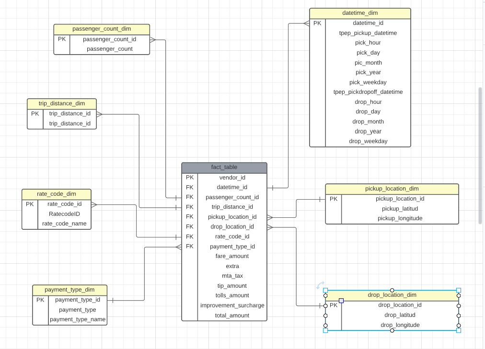

```python
import pandas as pd
```


```python
df = pd.read_csv("Data/Uberdataset.csv")
```


```python
df.head()
```


<div>
<style scoped>
    .dataframe tbody tr th:only-of-type {
        vertical-align: middle;
    }

    .dataframe tbody tr th {
        vertical-align: top;
    }

    .dataframe thead th {
        text-align: right;
    }
</style>
<table border="1" class="dataframe">
  <thead>
    <tr style="text-align: right;">
      <th></th>
      <th>VendorID</th>
      <th>tpep_pickup_datetime</th>
      <th>tpep_dropoff_datetime</th>
      <th>passenger_count</th>
      <th>trip_distance</th>
      <th>pickup_longitude</th>
      <th>pickup_latitude</th>
      <th>RatecodeID</th>
      <th>store_and_fwd_flag</th>
      <th>dropoff_longitude</th>
      <th>dropoff_latitude</th>
      <th>payment_type</th>
      <th>fare_amount</th>
      <th>extra</th>
      <th>mta_tax</th>
      <th>tip_amount</th>
      <th>tolls_amount</th>
      <th>improvement_surcharge</th>
      <th>total_amount</th>
    </tr>
  </thead>
  <tbody>
    <tr>
      <th>0</th>
      <td>1</td>
      <td>2016-03-01 00:00:00</td>
      <td>2016-03-01 00:07:55</td>
      <td>1</td>
      <td>2.50</td>
      <td>-73.976746</td>
      <td>40.765152</td>
      <td>1</td>
      <td>N</td>
      <td>-74.004265</td>
      <td>40.746128</td>
      <td>1</td>
      <td>9.0</td>
      <td>0.5</td>
      <td>0.5</td>
      <td>2.05</td>
      <td>0.00</td>
      <td>0.3</td>
      <td>12.35</td>
    </tr>
    <tr>
      <th>1</th>
      <td>1</td>
      <td>2016-03-01 00:00:00</td>
      <td>2016-03-01 00:11:06</td>
      <td>1</td>
      <td>2.90</td>
      <td>-73.983482</td>
      <td>40.767925</td>
      <td>1</td>
      <td>N</td>
      <td>-74.005943</td>
      <td>40.733166</td>
      <td>1</td>
      <td>11.0</td>
      <td>0.5</td>
      <td>0.5</td>
      <td>3.05</td>
      <td>0.00</td>
      <td>0.3</td>
      <td>15.35</td>
    </tr>
    <tr>
      <th>2</th>
      <td>2</td>
      <td>2016-03-01 00:00:00</td>
      <td>2016-03-01 00:31:06</td>
      <td>2</td>
      <td>19.98</td>
      <td>-73.782021</td>
      <td>40.644810</td>
      <td>1</td>
      <td>N</td>
      <td>-73.974541</td>
      <td>40.675770</td>
      <td>1</td>
      <td>54.5</td>
      <td>0.5</td>
      <td>0.5</td>
      <td>8.00</td>
      <td>0.00</td>
      <td>0.3</td>
      <td>63.80</td>
    </tr>
    <tr>
      <th>3</th>
      <td>2</td>
      <td>2016-03-01 00:00:00</td>
      <td>2016-03-01 00:00:00</td>
      <td>3</td>
      <td>10.78</td>
      <td>-73.863419</td>
      <td>40.769814</td>
      <td>1</td>
      <td>N</td>
      <td>-73.969650</td>
      <td>40.757767</td>
      <td>1</td>
      <td>31.5</td>
      <td>0.0</td>
      <td>0.5</td>
      <td>3.78</td>
      <td>5.54</td>
      <td>0.3</td>
      <td>41.62</td>
    </tr>
    <tr>
      <th>4</th>
      <td>2</td>
      <td>2016-03-01 00:00:00</td>
      <td>2016-03-01 00:00:00</td>
      <td>5</td>
      <td>30.43</td>
      <td>-73.971741</td>
      <td>40.792183</td>
      <td>3</td>
      <td>N</td>
      <td>-74.177170</td>
      <td>40.695053</td>
      <td>1</td>
      <td>98.0</td>
      <td>0.0</td>
      <td>0.0</td>
      <td>0.00</td>
      <td>15.50</td>
      <td>0.3</td>
      <td>113.80</td>
    </tr>
  </tbody>
</table>
</div>


```python
# Data Modeling / Dimensional Modeling
# We wan to convert this csv file into a star schema dimensional modelling (fact table and Dimensions tables)
```




```python
df.info() #notice =datetime are object formatted
```

    <class 'pandas.core.frame.DataFrame'>
    RangeIndex: 100000 entries, 0 to 99999
    Data columns (total 19 columns):
     #   Column                 Non-Null Count   Dtype  
    ---  ------                 --------------   -----  
     0   VendorID               100000 non-null  int64  
     1   tpep_pickup_datetime   100000 non-null  object 
     2   tpep_dropoff_datetime  100000 non-null  object 
     3   passenger_count        100000 non-null  int64  
     4   trip_distance          100000 non-null  float64
     5   pickup_longitude       100000 non-null  float64
     6   pickup_latitude        100000 non-null  float64
     7   RatecodeID             100000 non-null  int64  
     8   store_and_fwd_flag     100000 non-null  object 
     9   dropoff_longitude      100000 non-null  float64
     10  dropoff_latitude       100000 non-null  float64
     11  payment_type           100000 non-null  int64  
     12  fare_amount            100000 non-null  float64
     13  extra                  100000 non-null  float64
     14  mta_tax                100000 non-null  float64
     15  tip_amount             100000 non-null  float64
     16  tolls_amount           100000 non-null  float64
     17  improvement_surcharge  100000 non-null  float64
     18  total_amount           100000 non-null  float64
    dtypes: float64(12), int64(4), object(3)
    memory usage: 14.5+ MB
    


```python
df['tpep_pickup_datetime'] = pd.to_datetime(df['tpep_pickup_datetime'])
df['tpep_dropoff_datetime'] = pd.to_datetime(df['tpep_dropoff_datetime'])
```


```python
df.info() #notice datetime are datetime formatted
```

    <class 'pandas.core.frame.DataFrame'>
    RangeIndex: 100000 entries, 0 to 99999
    Data columns (total 19 columns):
     #   Column                 Non-Null Count   Dtype         
    ---  ------                 --------------   -----         
     0   VendorID               100000 non-null  int64         
     1   tpep_pickup_datetime   100000 non-null  datetime64[ns]
     2   tpep_dropoff_datetime  100000 non-null  datetime64[ns]
     3   passenger_count        100000 non-null  int64         
     4   trip_distance          100000 non-null  float64       
     5   pickup_longitude       100000 non-null  float64       
     6   pickup_latitude        100000 non-null  float64       
     7   RatecodeID             100000 non-null  int64         
     8   store_and_fwd_flag     100000 non-null  object        
     9   dropoff_longitude      100000 non-null  float64       
     10  dropoff_latitude       100000 non-null  float64       
     11  payment_type           100000 non-null  int64         
     12  fare_amount            100000 non-null  float64       
     13  extra                  100000 non-null  float64       
     14  mta_tax                100000 non-null  float64       
     15  tip_amount             100000 non-null  float64       
     16  tolls_amount           100000 non-null  float64       
     17  improvement_surcharge  100000 non-null  float64       
     18  total_amount           100000 non-null  float64       
    dtypes: datetime64[ns](2), float64(12), int64(4), object(1)
    memory usage: 14.5+ MB
    


```python
datetime_dim = df[['tpep_pickup_datetime','tpep_dropoff_datetime']].drop_duplicates().reset_index(drop=True)
datetime_dim['pick_hour'] = datetime_dim['tpep_pickup_datetime'].dt.hour
datetime_dim['pick_day'] = datetime_dim['tpep_pickup_datetime'].dt.day
datetime_dim['pick_month'] = datetime_dim['tpep_pickup_datetime'].dt.month
datetime_dim['pick_year'] = datetime_dim['tpep_pickup_datetime'].dt.year
datetime_dim['pick_weekday'] = datetime_dim['tpep_pickup_datetime'].dt.weekday

datetime_dim['drop_hour'] = datetime_dim['tpep_dropoff_datetime'].dt.hour
datetime_dim['drop_day'] = datetime_dim['tpep_dropoff_datetime'].dt.day
datetime_dim['drop_month'] = datetime_dim['tpep_dropoff_datetime'].dt.month
datetime_dim['drop_year'] = datetime_dim['tpep_dropoff_datetime'].dt.year
datetime_dim['drop_weekday'] = datetime_dim['tpep_dropoff_datetime'].dt.weekday
```


```python
datetime_dim['datetime_id'] = datetime_dim.index
```


```python
datetime_dim = datetime_dim[['datetime_id', 'tpep_pickup_datetime', 'pick_hour', 'pick_day', 'pick_month', 'pick_year', 'pick_weekday',
                             'tpep_dropoff_datetime', 'drop_hour', 'drop_day', 'drop_month', 'drop_year', 'drop_weekday']]
#
```


```python
datetime_dim
```


<div>
<style scoped>
    .dataframe tbody tr th:only-of-type {
        vertical-align: middle;
    }

    .dataframe tbody tr th {
        vertical-align: top;
    }

    .dataframe thead th {
        text-align: right;
    }
</style>
<table border="1" class="dataframe">
  <thead>
    <tr style="text-align: right;">
      <th></th>
      <th>datetime_id</th>
      <th>tpep_pickup_datetime</th>
      <th>pick_hour</th>
      <th>pick_day</th>
      <th>pick_month</th>
      <th>pick_year</th>
      <th>pick_weekday</th>
      <th>tpep_dropoff_datetime</th>
      <th>drop_hour</th>
      <th>drop_day</th>
      <th>drop_month</th>
      <th>drop_year</th>
      <th>drop_weekday</th>
    </tr>
  </thead>
  <tbody>
    <tr>
      <th>0</th>
      <td>0</td>
      <td>2016-03-01 00:00:00</td>
      <td>0</td>
      <td>1</td>
      <td>3</td>
      <td>2016</td>
      <td>1</td>
      <td>2016-03-01 00:07:55</td>
      <td>0</td>
      <td>1</td>
      <td>3</td>
      <td>2016</td>
      <td>1</td>
    </tr>
    <tr>
      <th>1</th>
      <td>1</td>
      <td>2016-03-01 00:00:00</td>
      <td>0</td>
      <td>1</td>
      <td>3</td>
      <td>2016</td>
      <td>1</td>
      <td>2016-03-01 00:11:06</td>
      <td>0</td>
      <td>1</td>
      <td>3</td>
      <td>2016</td>
      <td>1</td>
    </tr>
    <tr>
      <th>2</th>
      <td>2</td>
      <td>2016-03-01 00:00:00</td>
      <td>0</td>
      <td>1</td>
      <td>3</td>
      <td>2016</td>
      <td>1</td>
      <td>2016-03-01 00:31:06</td>
      <td>0</td>
      <td>1</td>
      <td>3</td>
      <td>2016</td>
      <td>1</td>
    </tr>
    <tr>
      <th>3</th>
      <td>3</td>
      <td>2016-03-01 00:00:00</td>
      <td>0</td>
      <td>1</td>
      <td>3</td>
      <td>2016</td>
      <td>1</td>
      <td>2016-03-01 00:00:00</td>
      <td>0</td>
      <td>1</td>
      <td>3</td>
      <td>2016</td>
      <td>1</td>
    </tr>
    <tr>
      <th>4</th>
      <td>4</td>
      <td>2016-03-01 00:00:01</td>
      <td>0</td>
      <td>1</td>
      <td>3</td>
      <td>2016</td>
      <td>1</td>
      <td>2016-03-01 00:16:04</td>
      <td>0</td>
      <td>1</td>
      <td>3</td>
      <td>2016</td>
      <td>1</td>
    </tr>
    <tr>
      <th>...</th>
      <td>...</td>
      <td>...</td>
      <td>...</td>
      <td>...</td>
      <td>...</td>
      <td>...</td>
      <td>...</td>
      <td>...</td>
      <td>...</td>
      <td>...</td>
      <td>...</td>
      <td>...</td>
      <td>...</td>
    </tr>
    <tr>
      <th>99848</th>
      <td>99848</td>
      <td>2016-03-01 06:17:10</td>
      <td>6</td>
      <td>1</td>
      <td>3</td>
      <td>2016</td>
      <td>1</td>
      <td>2016-03-01 06:22:15</td>
      <td>6</td>
      <td>1</td>
      <td>3</td>
      <td>2016</td>
      <td>1</td>
    </tr>
    <tr>
      <th>99849</th>
      <td>99849</td>
      <td>2016-03-01 06:17:10</td>
      <td>6</td>
      <td>1</td>
      <td>3</td>
      <td>2016</td>
      <td>1</td>
      <td>2016-03-01 06:32:41</td>
      <td>6</td>
      <td>1</td>
      <td>3</td>
      <td>2016</td>
      <td>1</td>
    </tr>
    <tr>
      <th>99850</th>
      <td>99850</td>
      <td>2016-03-01 06:17:10</td>
      <td>6</td>
      <td>1</td>
      <td>3</td>
      <td>2016</td>
      <td>1</td>
      <td>2016-03-01 06:37:23</td>
      <td>6</td>
      <td>1</td>
      <td>3</td>
      <td>2016</td>
      <td>1</td>
    </tr>
    <tr>
      <th>99851</th>
      <td>99851</td>
      <td>2016-03-01 06:17:10</td>
      <td>6</td>
      <td>1</td>
      <td>3</td>
      <td>2016</td>
      <td>1</td>
      <td>2016-03-01 06:22:09</td>
      <td>6</td>
      <td>1</td>
      <td>3</td>
      <td>2016</td>
      <td>1</td>
    </tr>
    <tr>
      <th>99852</th>
      <td>99852</td>
      <td>2016-03-01 06:17:11</td>
      <td>6</td>
      <td>1</td>
      <td>3</td>
      <td>2016</td>
      <td>1</td>
      <td>2016-03-01 06:22:00</td>
      <td>6</td>
      <td>1</td>
      <td>3</td>
      <td>2016</td>
      <td>1</td>
    </tr>
  </tbody>
</table>
<p>99853 rows × 13 columns</p>
</div>


```python
passenger_count_dim = df[['passenger_count']].drop_duplicates().reset_index(drop=True)
passenger_count_dim['passenger_count_id'] = passenger_count_dim.index
passenger_count_dim = passenger_count_dim[['passenger_count_id','passenger_count']]

trip_distance_dim = df[['trip_distance']].drop_duplicates().reset_index(drop=True)
trip_distance_dim['trip_distance_id'] = trip_distance_dim.index
trip_distance_dim = trip_distance_dim[['trip_distance_id','trip_distance']]
```


```python
passenger_count_dim.head()
```


<div>
<style scoped>
    .dataframe tbody tr th:only-of-type {
        vertical-align: middle;
    }

    .dataframe tbody tr th {
        vertical-align: top;
    }

    .dataframe thead th {
        text-align: right;
    }
</style>
<table border="1" class="dataframe">
  <thead>
    <tr style="text-align: right;">
      <th></th>
      <th>passenger_count_id</th>
      <th>passenger_count</th>
    </tr>
  </thead>
  <tbody>
    <tr>
      <th>0</th>
      <td>0</td>
      <td>1</td>
    </tr>
    <tr>
      <th>1</th>
      <td>1</td>
      <td>2</td>
    </tr>
    <tr>
      <th>2</th>
      <td>2</td>
      <td>3</td>
    </tr>
    <tr>
      <th>3</th>
      <td>3</td>
      <td>5</td>
    </tr>
    <tr>
      <th>4</th>
      <td>4</td>
      <td>6</td>
    </tr>
  </tbody>
</table>
</div>


```python
trip_distance_dim.head()
```


<div>
<style scoped>
    .dataframe tbody tr th:only-of-type {
        vertical-align: middle;
    }

    .dataframe tbody tr th {
        vertical-align: top;
    }

    .dataframe thead th {
        text-align: right;
    }
</style>
<table border="1" class="dataframe">
  <thead>
    <tr style="text-align: right;">
      <th></th>
      <th>trip_distance_id</th>
      <th>trip_distance</th>
    </tr>
  </thead>
  <tbody>
    <tr>
      <th>0</th>
      <td>0</td>
      <td>2.50</td>
    </tr>
    <tr>
      <th>1</th>
      <td>1</td>
      <td>2.90</td>
    </tr>
    <tr>
      <th>2</th>
      <td>2</td>
      <td>19.98</td>
    </tr>
    <tr>
      <th>3</th>
      <td>3</td>
      <td>10.78</td>
    </tr>
    <tr>
      <th>4</th>
      <td>4</td>
      <td>30.43</td>
    </tr>
  </tbody>
</table>
</div>


```python
rate_code_type = {
    1:"Standard rate",
    2:"JFK",
    3:"Newark",
    4:"Nassau or Westchester",
    5:"Negotiated fare",
    6:"Group ride"
}

rate_code_dim = df[['RatecodeID']].drop_duplicates().reset_index(drop=True)
rate_code_dim['rate_code_id'] = rate_code_dim.index
rate_code_dim['rate_code_name'] = rate_code_dim['RatecodeID'].map(rate_code_type)
rate_code_dim = rate_code_dim[['rate_code_id','RatecodeID','rate_code_name']]
```


```python
rate_code_dim.head()
```


<div>
<style scoped>
    .dataframe tbody tr th:only-of-type {
        vertical-align: middle;
    }

    .dataframe tbody tr th {
        vertical-align: top;
    }

    .dataframe thead th {
        text-align: right;
    }
</style>
<table border="1" class="dataframe">
  <thead>
    <tr style="text-align: right;">
      <th></th>
      <th>rate_code_id</th>
      <th>RatecodeID</th>
      <th>rate_code_name</th>
    </tr>
  </thead>
  <tbody>
    <tr>
      <th>0</th>
      <td>0</td>
      <td>1</td>
      <td>Standard rate</td>
    </tr>
    <tr>
      <th>1</th>
      <td>1</td>
      <td>3</td>
      <td>Newark</td>
    </tr>
    <tr>
      <th>2</th>
      <td>2</td>
      <td>2</td>
      <td>JFK</td>
    </tr>
    <tr>
      <th>3</th>
      <td>3</td>
      <td>5</td>
      <td>Negotiated fare</td>
    </tr>
    <tr>
      <th>4</th>
      <td>4</td>
      <td>4</td>
      <td>Nassau or Westchester</td>
    </tr>
  </tbody>
</table>
</div>


```python
pickup_location_dim = df[['pickup_longitude', 'pickup_latitude']].drop_duplicates().reset_index(drop=True)
pickup_location_dim['pickup_location_id'] = pickup_location_dim.index
pickup_location_dim = pickup_location_dim[['pickup_location_id','pickup_latitude','pickup_longitude']] 


dropoff_location_dim = df[['dropoff_longitude', 'dropoff_latitude']].drop_duplicates().reset_index(drop=True)
dropoff_location_dim['dropoff_location_id'] = dropoff_location_dim.index
dropoff_location_dim = dropoff_location_dim[['dropoff_location_id','dropoff_latitude','dropoff_longitude']]
```


```python
payment_type_name = {
    1:"Credit card",
    2:"Cash",
    3:"No charge",
    4:"Dispute",
    5:"Unknown",
    6:"Voided trip"
}
payment_type_dim = df[['payment_type']].drop_duplicates().reset_index(drop=True)
payment_type_dim['payment_type_id'] = payment_type_dim.index
payment_type_dim['payment_type_name'] = payment_type_dim['payment_type'].map(payment_type_name)
payment_type_dim = payment_type_dim[['payment_type_id','payment_type','payment_type_name']]
```


```python
payment_type_dim.head()
```


<div>
<style scoped>
    .dataframe tbody tr th:only-of-type {
        vertical-align: middle;
    }

    .dataframe tbody tr th {
        vertical-align: top;
    }

    .dataframe thead th {
        text-align: right;
    }
</style>
<table border="1" class="dataframe">
  <thead>
    <tr style="text-align: right;">
      <th></th>
      <th>payment_type_id</th>
      <th>payment_type</th>
      <th>payment_type_name</th>
    </tr>
  </thead>
  <tbody>
    <tr>
      <th>0</th>
      <td>0</td>
      <td>1</td>
      <td>Credit card</td>
    </tr>
    <tr>
      <th>1</th>
      <td>1</td>
      <td>2</td>
      <td>Cash</td>
    </tr>
    <tr>
      <th>2</th>
      <td>2</td>
      <td>3</td>
      <td>No charge</td>
    </tr>
    <tr>
      <th>3</th>
      <td>3</td>
      <td>4</td>
      <td>Dispute</td>
    </tr>
  </tbody>
</table>
</div>


```python
fact_table = df.merge(passenger_count_dim, on='passenger_count') \
             .merge(trip_distance_dim, on='trip_distance') \
             .merge(rate_code_dim, on='RatecodeID') \
             .merge(pickup_location_dim, on=['pickup_longitude', 'pickup_latitude']) \
             .merge(dropoff_location_dim, on=['dropoff_longitude', 'dropoff_latitude'])\
             .merge(datetime_dim, on=['tpep_pickup_datetime','tpep_dropoff_datetime']) \
             .merge(payment_type_dim, on='payment_type') \
             [['VendorID', 'datetime_id', 'passenger_count_id',
               'trip_distance_id', 'rate_code_id', 'store_and_fwd_flag', 'pickup_location_id', 'dropoff_location_id',
               'payment_type_id', 'fare_amount', 'extra', 'mta_tax', 'tip_amount', 'tolls_amount',
               'improvement_surcharge', 'total_amount']]
```


```python
fact_table
```


<div>
<style scoped>
    .dataframe tbody tr th:only-of-type {
        vertical-align: middle;
    }

    .dataframe tbody tr th {
        vertical-align: top;
    }

    .dataframe thead th {
        text-align: right;
    }
</style>
<table border="1" class="dataframe">
  <thead>
    <tr style="text-align: right;">
      <th></th>
      <th>VendorID</th>
      <th>datetime_id</th>
      <th>passenger_count_id</th>
      <th>trip_distance_id</th>
      <th>rate_code_id</th>
      <th>store_and_fwd_flag</th>
      <th>pickup_location_id</th>
      <th>dropoff_location_id</th>
      <th>payment_type_id</th>
      <th>fare_amount</th>
      <th>extra</th>
      <th>mta_tax</th>
      <th>tip_amount</th>
      <th>tolls_amount</th>
      <th>improvement_surcharge</th>
      <th>total_amount</th>
    </tr>
  </thead>
  <tbody>
    <tr>
      <th>0</th>
      <td>1</td>
      <td>0</td>
      <td>0</td>
      <td>0</td>
      <td>0</td>
      <td>N</td>
      <td>0</td>
      <td>0</td>
      <td>0</td>
      <td>9.0</td>
      <td>0.5</td>
      <td>0.5</td>
      <td>2.05</td>
      <td>0.0</td>
      <td>0.3</td>
      <td>12.35</td>
    </tr>
    <tr>
      <th>1</th>
      <td>2</td>
      <td>1491</td>
      <td>0</td>
      <td>0</td>
      <td>0</td>
      <td>N</td>
      <td>1481</td>
      <td>1484</td>
      <td>0</td>
      <td>10.5</td>
      <td>0.0</td>
      <td>0.5</td>
      <td>2.26</td>
      <td>0.0</td>
      <td>0.3</td>
      <td>13.56</td>
    </tr>
    <tr>
      <th>2</th>
      <td>2</td>
      <td>2834</td>
      <td>0</td>
      <td>0</td>
      <td>0</td>
      <td>N</td>
      <td>2816</td>
      <td>2819</td>
      <td>0</td>
      <td>9.5</td>
      <td>0.0</td>
      <td>0.5</td>
      <td>1.25</td>
      <td>0.0</td>
      <td>0.3</td>
      <td>11.55</td>
    </tr>
    <tr>
      <th>3</th>
      <td>2</td>
      <td>3488</td>
      <td>0</td>
      <td>0</td>
      <td>0</td>
      <td>N</td>
      <td>3465</td>
      <td>3470</td>
      <td>0</td>
      <td>13.5</td>
      <td>0.0</td>
      <td>0.5</td>
      <td>2.00</td>
      <td>0.0</td>
      <td>0.3</td>
      <td>16.30</td>
    </tr>
    <tr>
      <th>4</th>
      <td>2</td>
      <td>3923</td>
      <td>0</td>
      <td>0</td>
      <td>0</td>
      <td>N</td>
      <td>3899</td>
      <td>3903</td>
      <td>0</td>
      <td>10.5</td>
      <td>0.0</td>
      <td>0.5</td>
      <td>2.26</td>
      <td>0.0</td>
      <td>0.3</td>
      <td>13.56</td>
    </tr>
    <tr>
      <th>...</th>
      <td>...</td>
      <td>...</td>
      <td>...</td>
      <td>...</td>
      <td>...</td>
      <td>...</td>
      <td>...</td>
      <td>...</td>
      <td>...</td>
      <td>...</td>
      <td>...</td>
      <td>...</td>
      <td>...</td>
      <td>...</td>
      <td>...</td>
      <td>...</td>
    </tr>
    <tr>
      <th>99995</th>
      <td>1</td>
      <td>65943</td>
      <td>0</td>
      <td>257</td>
      <td>3</td>
      <td>N</td>
      <td>64896</td>
      <td>65105</td>
      <td>3</td>
      <td>170.0</td>
      <td>0.0</td>
      <td>0.0</td>
      <td>0.00</td>
      <td>0.0</td>
      <td>0.3</td>
      <td>170.30</td>
    </tr>
    <tr>
      <th>99996</th>
      <td>1</td>
      <td>81651</td>
      <td>0</td>
      <td>257</td>
      <td>3</td>
      <td>N</td>
      <td>80276</td>
      <td>80547</td>
      <td>3</td>
      <td>10.0</td>
      <td>0.0</td>
      <td>0.0</td>
      <td>0.00</td>
      <td>0.0</td>
      <td>0.3</td>
      <td>10.30</td>
    </tr>
    <tr>
      <th>99997</th>
      <td>2</td>
      <td>87152</td>
      <td>4</td>
      <td>257</td>
      <td>1</td>
      <td>N</td>
      <td>85670</td>
      <td>85971</td>
      <td>3</td>
      <td>-20.0</td>
      <td>-0.5</td>
      <td>0.0</td>
      <td>0.00</td>
      <td>0.0</td>
      <td>-0.3</td>
      <td>-20.80</td>
    </tr>
    <tr>
      <th>99998</th>
      <td>2</td>
      <td>53874</td>
      <td>4</td>
      <td>1060</td>
      <td>1</td>
      <td>N</td>
      <td>53081</td>
      <td>53222</td>
      <td>3</td>
      <td>-25.5</td>
      <td>0.0</td>
      <td>0.0</td>
      <td>0.00</td>
      <td>0.0</td>
      <td>-0.3</td>
      <td>-25.80</td>
    </tr>
    <tr>
      <th>99999</th>
      <td>1</td>
      <td>88727</td>
      <td>0</td>
      <td>1894</td>
      <td>1</td>
      <td>N</td>
      <td>87206</td>
      <td>87511</td>
      <td>3</td>
      <td>70.5</td>
      <td>0.5</td>
      <td>0.0</td>
      <td>0.00</td>
      <td>10.5</td>
      <td>0.3</td>
      <td>81.80</td>
    </tr>
  </tbody>
</table>
<p>100000 rows × 16 columns</p>
</div>


```python

```
